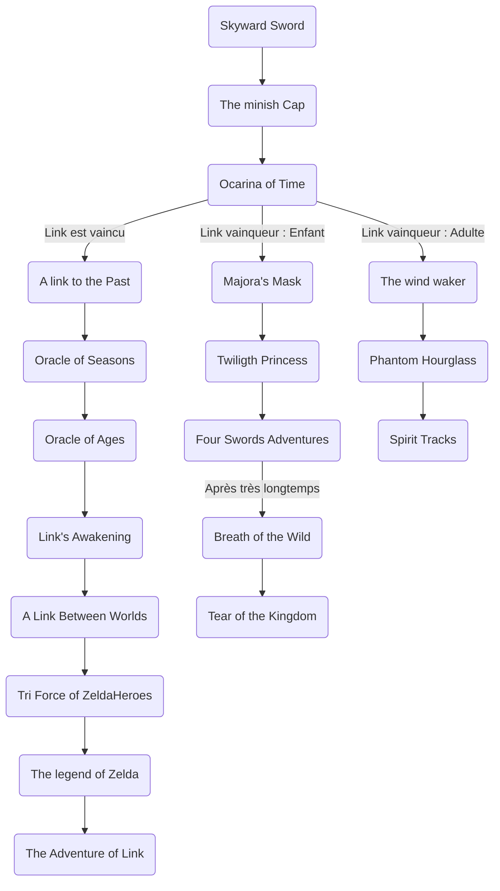

# 🗺️ **La Chronologie Complète de The Legend of Zelda**

### **I. Avant la division temporelle : les origines de Hyrule**

La saga commence dans un passé lointain, bien avant les événements des premiers jeux Zelda.

**1. Skyward Sword (2011)**  
Dans **Skyward Sword**, l’histoire commence avec la naissance d’Hyrule et des premiers héros. C'est là que nous découvrons que **Zelda** est la réincarnation de **la déesse Hylia**, et **Link** naît en tant que héros choisi pour défendre le monde contre les forces du mal. Le **Roi Démon**, **Demise**, est une menace ancienne, et c'est à travers cette lutte que l’Épée Divi**ne** (la future **Master Sword**) est créée pour sceller Demise, posant ainsi les bases des conflits futurs.

**2. The Minish Cap (Perfect Edition)**  
Dans **The Minish Cap**, Link se lance dans une aventure pour sauver le royaume d’Hyrule de **Vaati**, un Minish maléfique. L’histoire montre la première utilisation de **l’Épée de Quatre**, un artefact puissant, et introduit l’idée de la **Triforce**, bien que cette dernière ne soit pas encore au centre de l’intrigue. Ce jeu est crucial car il montre les racines de certaines magies qui apparaîtront plus tard, notamment l’histoire des **Minish**.

**3. Four Swords (Perfect Edition)**  
Après les événements de The Minish Cap, **Vaati** refait surface et menace de nouveau Hyrule. Dans **Four Swords**, Link utilise l’Épée de Quatre pour se diviser en quatre copies de lui-même, chacune ayant des pouvoirs spécifiques, afin de vaincre Vaati et sauver le royaume. Ce jeu est une continuation de l’histoire de la **Four Sword**, introduisant l'idée du pouvoir divisé et du travail en équipe, des éléments qui seront importants plus tard dans la série.

**4. Ocarina of Time (Perfect Edition)**  
**Ocarina of Time** est sans doute le jeu le plus influent de la saga. L’histoire commence avec **Link**, un jeune garçon vivant dans la forêt Kokiri, qui doit empêcher le sorcier **Ganondorf** de prendre le contrôle d’Hyrule. **Link** voyage dans le temps grâce à l’**Ocarina du Temps** et devient à la fois l’enfant héroïque et l’adulte capable de combattre Ganondorf. L’histoire se termine par la **division de la chronologie** après la bataille contre Ganondorf, selon que Link soit victorieux et reste adulte, ou qu’il revienne à son enfance. Cette décision marque le début de trois lignes temporelles distinctes.

---

### **II. La division temporelle après Ocarina of Time**

Après les événements de **Ocarina of Time**, l’univers de Zelda se divise en trois chronologies distinctes, chacune suivant un scénario différent :

---

### **1. La Chronologie de la Défaite de Link**

Dans cette ligne temporelle, **Link échoue à stopper Ganondorf** et le royaume d'Hyrule tombe sous son pouvoir. Ganondorf prend possession de la **Triforce** et plonge le royaume dans une période de ténèbres.

#### **A Link to the Past (Perfect Edition)**

Après la chute de Hyrule, une nouvelle génération d'Héros émerge. **Link** doit empêcher **Ganondorf** (caché sous l'apparence de **Ganon**) de dominer à nouveau Hyrule. Il voyage à travers le **Monde des Ténèbres** pour récupérer la **Triforce** et sauver Zelda. Ce jeu est l’un des plus importants, car il introduit l'idée du **monde parallèle**, avec la distinction entre le **monde de la lumière** et le **monde des ténèbres**.

#### **Oracle of Seasons et Oracle of Ages (Perfect Editions)**

Dans cette suite, **Link** se rend dans les royaumes parallèles d’**Holodrum** et **Labrynna**, où il rencontre **Nayru** et **Din**, les **Oracles**. Il doit empêcher un mal ancien de détruire ces royaumes. Ces jeux sont étroitement liés : il est conseillé de jouer à **Oracle of Seasons** avant **Oracle of Ages**, car l’histoire se poursuit directement d’un jeu à l’autre.

#### **Link's Awakening**

Après ses aventures dans **A Link to the Past** et les **Oracle**, **Link** est naufragé sur une île mystérieuse. Il doit découvrir pourquoi l'île est plongée dans un cycle sans fin et libérer le **Poisson Rêve**.

#### **A Link Between Worlds**

Des générations après, un nouveau Link émerge pour combattre **Yuga**, un sorcier maléfique qui cherche à prendre le contrôle de la **Triforce**. Ce jeu reprend les mécaniques de **A Link to the Past**, mais avec un nouveau twist : **Link** peut maintenant se fondre dans les murs et voyager entre le monde de la lumière et celui des ténèbres.

#### **Tri Force Heroes**

Dans **Tri Force Heroes**, trois héros doivent coopérer pour sauver un royaume magique. Ce jeu se déroule dans une dimension parallèle et se distingue par son approche en coopération multijoueur.

#### **The Legend of Zelda et The Adventure of Link**

Ce sont les **premiers jeux Zelda**, où **Link** doit récupérer la **Triforce de la Sagesse** pour sauver **Zelda** (la princesse d'Hyrule). **The Adventure of Link** suit les événements de **The Legend of Zelda** et voit un Link adulte lutter contre **Ganon** pour sauver Hyrule.

---

### **2. La Chronologie du Héros Adulte**

Dans cette ligne temporelle, **Link réussit à sceller Ganondorf**, mais décide de rester adulte, devenant ainsi le **Héros du Temps**. La **Triforce** est préservée, mais le destin du royaume d'Hyrule est radicalement différent.

#### **The Wind Waker**

Dans cette chronologie, **Hyrule est englouti sous l'eau** après la défaite de Ganondorf. **Link** et **Zelda**, dans une version plus jeune, se retrouvent sur des îles lointaines. C’est un monde où les personnages doivent naviguer et explorer les océans. **Ganondorf** réapparaît ici, et l’histoire fait référence aux événements de **Ocarina of Time**.

#### **Phantom Hourglass**

Après les événements de **The Wind Waker**, **Link** et **Tetra** voyagent sur un nouveau continent. Ils se retrouvent pris dans les mystères du **Phantom Hourglass** et doivent sauver un royaume enchanté.

#### **Spirit Tracks**

Des générations après **Phantom Hourglass**, **Link** (qui n’est plus le même héros, mais son descendant) doit lutter contre une menace qui touche la **Triforce** et protéger un chemin ferroviaire magique. Ce jeu se déroule dans un monde similaire à **The Wind Waker**, mais avec des trains à vapeur au lieu de navires.

---

### **3. La Chronologie du Héros Enfant**

Dans cette ligne temporelle, **Link réussit à sceller Ganondorf**, mais il revient à son enfance pour vivre une vie paisible, et il ne porte plus la **Triforce du Courage**.

#### **Majora’s Mask**

Peu après les événements de **Ocarina of Time**, **Link** se retrouve transporté dans un monde parallèle, **Termina**, où il doit sauver ce monde d’une lune qui se précipite vers la planète. **Majora’s Mask** est un jeu centré sur la manipulation du temps et des cycles, et il fait référence à un autre aspect de la lutte contre le mal dans le royaume de Zelda.

#### **Twilight Princess**

**Twilight Princess** se déroule plusieurs années après **Majora’s Mask**. **Link** devient un héros dans un Hyrule plongé dans les ténèbres par **Zant** et **Ganondorf**. Cette histoire marque une évolution plus sombre de la saga avec un **Link** adulte qui doit sauver les royaumes du crépuscule et rétablir la lumière.

#### **Four Swords Adventures**

Ce jeu reprend l’idée de la **Four Sword** et de ses pouvoirs magiques. **Link** se divise à nouveau en plusieurs versions de lui-même pour sauver Hyrule d’un mal ancien.

---

### **3. La Chronologie de Breath of the Wild et Tears of the Kingdom**

Les événements de **Breath of the Wild** et **Tears of the Kingdom** se déroulent dans **un futur lointain**, **après la disparition de toute l’histoire précédente**. Ces jeux n'ont pas encore de lien direct avec les anciennes chronologies, mais l'**Hyrule du futur** semble être un monde **décadent**, marqué par la résurgence des forces du mal (notamment **Calamity Ganon**) et les échos des anciennes légendes. Nintendo a voulu offrir une nouvelle vision, indépendante des anciennes lignes temporelles, en plaçant ces jeux des **millénaires après les événements classiques** de la saga.

---

# 🌟 **Résumé Final** (avec les jeux et mangas associés)

1. **Skyward Sword** - Origines de la saga.
    
2. **The Minish Cap** - Premiers signes de la magie et de la Triforce.
    
3. **Four Swords** - Lutte contre Vaati et première utilisation de l'Épée de Quatre.
    
4. **Ocarina of Time** - La division des timelines.
    
    Puis trois chronologies :
    
    - **Chronologie de la défaite de Link** :
        
        - **A Link to the Past**, **Oracle of Seasons/Ages**, **Link's Awakening**, **Tri Force Heroes**, **The Legend of Zelda**.
            
    - **Chronologie du héros adulte** :
        
        - **The Wind Waker**, **Phantom Hourglass**, **Spirit Tracks**.
            
    - **Chronologie du héros enfant** :
        
        - **Majora’s Mask**, **Twilight Princess**, **Four Swords Adventures**.
            
5. **Breath of the Wild** et **Tears of the Kingdom** se situent dans un futur post-apocalyptique, des **millénaires après** les événements classiques.
    

# Résumé visuel de la chronologie

