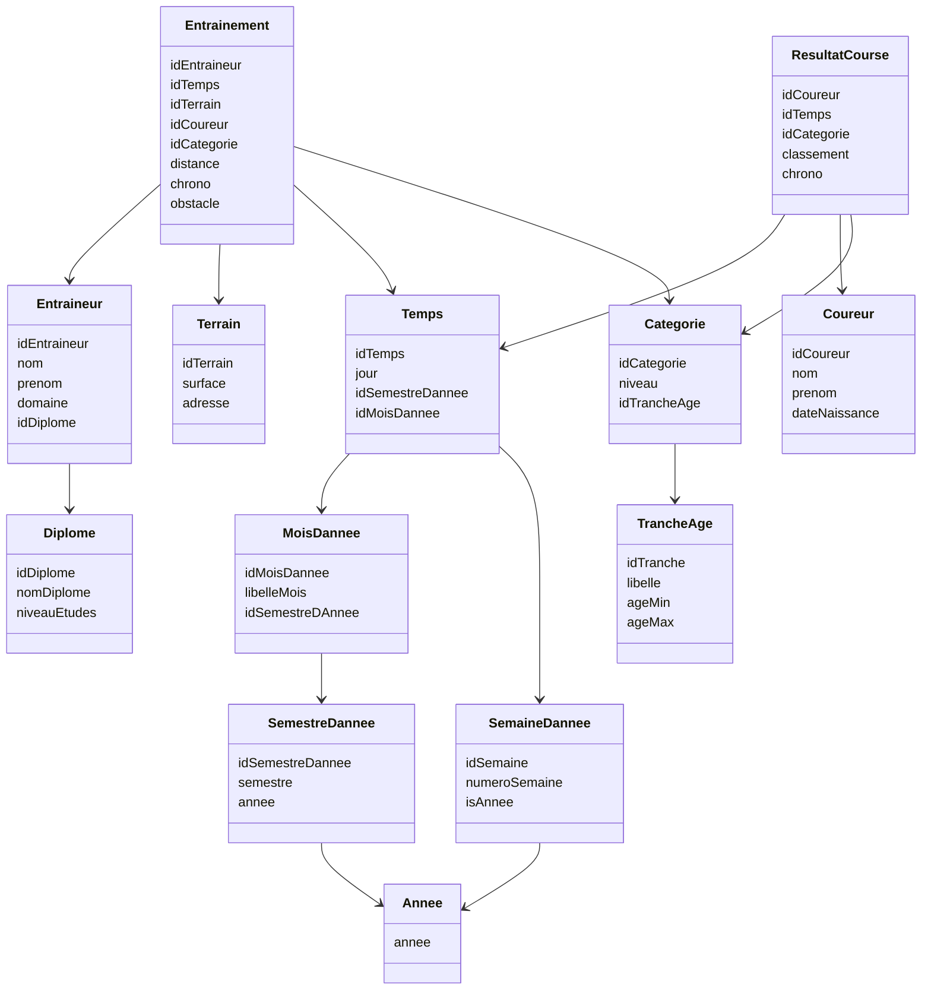

# Exercice 1
Il existe les DF suivants :
- `trancheAge -> ageMin, ageMax`
- `nomDiplome -> niveauEtudes`
- `Mois -> semestre`

# Exercice 2
**Question 1**

|                                  | Bac d'origine | Age | Mineur | Groupe | Semestre | Annee | Horaire | UE  | Type épreuve |
| -------------------------------- | ------------- | --- | ------ | ------ | -------- | ----- | ------- | --- | ------------ |
| Pourcentage d'absent             | X             | X   | X      |        |          |       |         |     |              |
| Nombre étudiant absents          |               |     |        | X      | X        | X     |         |     |              |
| Nombre absents                   |               |     |        |        |          |       | X       |     |              |
| Pourcentage absents              |               |     |        |        |          |       |         | X   | X            |
| Note moyenne / Mediane / Min max |               |     |        | X      | X        | X     |         | X   |              |
