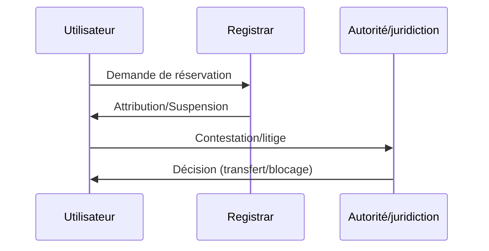

# 🧭 Note de synthèse juridique : Le régime juridique des noms de domaine

---

## 💡 Mise en contexte

Les **noms de domaine** sont aujourd’hui un élément clé de l’identité numérique. Ils simplifient l’accès aux sites en remplaçant les adresses IP par des repères lisibles, et représentent plus de **350 millions d’enregistrements** dans le monde. Leur gestion constitue donc un enjeu stratégique pour les acteurs du numérique.

Le système repose sur plusieurs catégories :

- les **gTLD** (.com, .org, .net) ;
    
- les **ccTLD** liés à un territoire (.fr, .de) ;
    
- les **nTLD** plus récents (.shop, .app, .tech).
    

Cette diversité accroît les possibilités d’identification mais complexifie aussi l’écosystème : concurrence entre titulaires, cybersquatting, conflits avec les marques ou saturation des noms disponibles.

Dès lors, une question centrale se pose : comment concilier une **liberté de réservation large** avec la **protection des droits des tiers** et le respect de l’ordre public ? Le cadre juridique actuel — mêlant règles techniques, droit de la propriété intellectuelle et procédures de règlement des litiges — vise précisément à équilibrer ces exigences.

---
## Nature juridique du nom de domaine

| Fonction principale                           | Nature juridique                                 | Résultat / Protection                                                                                                     |
| --------------------------------------------- | ------------------------------------------------ | ------------------------------------------------------------------------------------------------------------------------- |
| Identifie un site, porte l’identité numérique | Signe distinctif, sans constituer un droit de PI | Droit d’usage attribué au titulaire, sans droit de propriété                                                              |
| Sert d’actif économique valorisable           | Élément du patrimoine immatériel d’une personne  | Protection jurisprudentielle fondée notamment sur l’action en **concurrence déloyale** (risque de confusion, parasitisme) |
- Un nom de domaine **ne confère pas un titre de propriété intellectuelle** mais bénéficie d’une protection contre l’usurpation ou les usages déloyaux selon les principes du droit commun (concurrence déloyale, responsabilité civile, etc.).[irpi+1](https://www.irpi.fr/revuepi/article.asp?ART_N_ID=260)​
    
- L’usage effectif et loyal est une condition cruciale pour bénéficier de cette protection.

## Autorités compétentes

### Cadre institutionnel et juridique

|Niveau|Instance ou organisme|Rôle principal|
|---|---|---|
|**International**|ICANN, WIPO / OMPI|Attribution et supervision des TLD, gestion de la procédure UDRP, arbitrages relatifs aux gTLD|
|**Europe**|EURid (.eu), DSA|Gestion des .eu, obligations issues du Digital Services Act, harmonisation des règles numériques|
|**France / national**|AFNIC, INPI, Tribunaux|Gestion des .fr (AFNIC), procédure Syreli, enregistrement des marques (INPI), contentieux judiciaires|

---

### Textes et mécanismes juridiques applicables

- **CPCE (art. L45-1 et s.)** : encadre l’attribution, le renouvellement et le retrait des noms de domaine .fr et des extensions territoriales françaises.
- **CPI (art. L711-4)** : sanctionne les enregistrements portant atteinte à une marque (risque de confusion, mauvaise foi…).
- **Syreli (AFNIC)** : procédure alternative française pour résoudre rapidement les litiges sur les .fr, en ligne et sans audience.
- **UDRP (OMPI / ICANN)** : procédure extrajudiciaire internationale pour les gTLD (.com, .net, .org…) et certaines nTLD.
- **Registres (registries)** : opérateurs techniques et administratifs responsables d’une extension (ex. AFNIC pour .fr, Verisign pour .com, EURid pour .eu), assurant l’enregistrement, la maintenance, les règles d’éligibilité, la résolution des litiges et la coopération avec l’ICANN.

---

## La liberté de réservation : principes et restrictions

| Liberté reconnue                           | Limites posées par le droit                            |
| ------------------------------------------ | ------------------------------------------------------ |
| Premier arrivé, premier servi              | Droits antérieurs : marque, droit au nom, dénomination |
| Procédure simple auprès d’un registrar     | Usurpation/confusion, parasitisme, typosquatting       |
| Large choix des TLD (.fr, .com, .eu, etc.) | Ordre public, bonnes mœurs, institutions publiques     |
| Absence de contrôle a priori du contenu    | Extensions/secteurs régis par des règles particulières |

**Exemple** : Il est interdit d’enregistrer un domaine « fr » reprenant le nom d’une marque déposée, d’institution publique ou portant atteinte à l’ordre public.[exprime-avocat](https://www.exprime-avocat.fr/enregistrer-un-nom-de-domaine-droits-et-limites/)​

## Protection contentieuse et règlement des litiges

|Voie|Procédure|Effets possibles|
|---|---|---|
|Administrative|SYRELI (.fr), UDRP (gTLD), ADR (.eu)|Transfert, suppression ou blocage du domaine|
|Judiciaire|Tribunal judiciaire, référé|Indemnisation, cessation, publication sanction|
|Alternative|Médiation, arbitrage|Résolution amiable|

- **Chiffres récents UDRP** : 85 % de réussite pour les plaignants, délais moyens de **2 à 4 mois** selon la complexité du dossier.
- **Procédure SYRELI (pour les .fr)** : très utilisée ; décisions publiques sur le site de l’AFNIC. Délais :
    - **21 jours** pour la réponse du titulaire,
    - **Décision rendue dans un maximum de 2 mois**,
    - Durée réelle observée : **environ 20 à 45 jours** selon les statistiques récentes.
- **Jurisprudence 2025** : Paris, 23 avril 2025 — condamnation importante de cas de typosquatting en .fr.
- **ADR européenne (.eu et secteurs émergents)** : existence d’un cadre harmonisé au niveau de l’Union européenne pour la résolution extrajudiciaire des litiges (procédure ADR gérée notamment par EURid).​
    

---

## Actualités récentes, doctrine et nouveaux enjeux techniques

- **Blockchain** : reconnaissance croissante de la preuve blockchain pour dater les droits d’antériorité (France/Europe 2025).[dreyfus+1](https://www.dreyfus.fr/2025/10/15/la-preuve-par-blockchain-est%E2%80%91elle-reconnue-en-matiere-de-droit-dauteur/)
    
- **DSA européen 2024/2025** : nouvelles obligations pour plateformes et intermédiaires : transparence, retrait accéléré, lutte contre l’automatisation abusive.[atelierjuridique+1](https://www.atelierjuridique.fr/lencadrement-juridique-des-noms-de-domaine-reserves-enjeux-et-perspectives/)
    
- **CNIL/CEPD 2025** : encadrement RGPD même pour solutions blockchainisées (privacy-by-design, souveraineté).[cnil+1](https://www.cnil.fr/fr/cepd-nouveaux-documents-certification-blockchain-ia)
    
- **IA & cybersécurité** : montée du typosquatting automatisé, réponses européennes (règlement IA, surveillance accrue).[lexbase+1](https://www.lexbase.fr/article-juridique/126027416-doctrine-le-reglement-sur-lintelligence-artificielle-et-le-droit-des-affaires)
    

---

## Jurisprudence et analyse doctrinale récentes

- **TJ Paris, 2025** : notoriété et usage antérieur d’un domaine déterminants pour caractériser mauvaise foi ou parasitisme.[avocat-perrine-bailliez+1](https://www.avocat-perrine-bailliez.fr/jurisprudence-revolutionnaire-ce-quil-faut-savoir-en-2025/)
    
- Doctrine militante : demande d’harmonisation législative sur force probante des ancrages blockchain et reconnaissance transnationale via l’OMPI.[consultation.avocat+1](https://consultation.avocat.fr/blog/murielle-isabelle-cahen/article-2975392-createurs-comment-la-blockchain-change-la-donne-pour-prouver-vos-droits-d-auteur.html)
    
- Arrêts reconnus : revendication d’un domaine par collectivité locale, stratégie contre le domain tasting, évolution statut d’ayant droit.[legalis+1](https://www.legalis.net/actualite/typosquatting-blocage-judiciaire-de-39-noms-de-domaine-en-fr/)
    

---

## Conseils stratégiques & cas pratiques

- **Déposer et maintenir sa marque** à l’INPI ; surveiller domaines connexes.[exprime-avocat+1](https://www.exprime-avocat.fr/enregistrer-un-nom-de-domaine-droits-et-limites/)
    
- **Choisir ses extensions** : .fr priorité nationale, .com, .eu, nouveaux TLD sectoriels.[dreyfus](https://www.dreyfus.fr/2025/08/06/guide-complet-2025-litiges-en-matiere-de-noms-de-domaine-procedure-udrp-syreli-et-alternatives-internationales/)
    
- **Protections techniques** : DNSSEC, surveillance, mots de passe sécurisés, double authentification.[monconseildroit+1](https://www.monconseildroit.fr/la-protection-des-marques-face-a-lusurpation-de-noms-de-domaine-enjeux-juridiques-et-strategies/)
    
- **Réagir vite** : plus l’action est rapide, plus l’usage effectif est un argument solide.[afnic+1](https://www.afnic.fr/observatoire-ressources/agenda/rencontres-juridiques-afnic-2025/)
    
- **Preuves numériques** : documentation continue (certificats, blockchain, archives).[dreyfus+1](https://www.dreyfus.fr/2025/10/15/la-preuve-par-blockchain-est%E2%80%91elle-reconnue-en-matiere-de-droit-dauteur/)
    

---

## Enjeux futurs, évolution du modèle

- **Valorisation économique et patrimoniale** : noms comme actifs, fiscalité immatérielle.[atelierjuridique](https://www.atelierjuridique.fr/lencadrement-juridique-des-noms-de-domaine-reserves-enjeux-et-perspectives/)
    
- **IA & cybersécurité** : lutte contre réservation massive, solutions par biométrie ou scoring.[lexbase](https://www.lexbase.fr/article-juridique/126027416-doctrine-le-reglement-sur-lintelligence-artificielle-et-le-droit-des-affaires)
    
- **Web3 & régulation internationale** : droit mondial de la preuve numérique/blockchain, harmonisation RGPD-DSA-IA Act.[silexo+2](https://silexo.fr/article/149/blockchain-et-rgpd-analyse-des-lignes-directrices-02-2025-du-cepd-et-enjeux-de-souverainete-numerique)
    
- **Extensions thématiques et réputation** : geo, pro, etc.[congres-uinl-paris](https://www.congres-uinl-paris.org/noms-de-domaine-regionaux-analyse-jurisprudentielle-des-extensions-territoriales/)
    

# 📚 Liens des sources utilisées et recommandées

- [Atelier Juridique — Encadrement juridique des noms de domaine (2025)](https://atelierjuridique.fr/nom-de-domaine-encadrement)
    
- [AFNIC — Rencontres juridiques 2025, actualité Syreli et tendances](https://www.afnic.fr/observatoire-ressources/dossiers-thematiques/rencontres-juridiques-afnic-2025/)
    
- [Exprime Avocat — Enregistrement, droits & limites d’un nom de domaine (2022)](https://exprime-avocat.fr/enregistrer-un-nom-de-domaine-droits-et-limites/)
    
- [Dreyfus — Guide 2025, contentieux et litiges noms de domaine](https://www.dreyfus.fr/guide-complet-litiges-noms-de-domaine/)
    
- [Jurisprudence Legalis — Typosquatting, TJ Paris avril 2025](https://www.legalis.net)
    
- [CNIL — Certification et Blockchain, lignes directrices IA 2025](https://www.cnil.fr/fr/certification-blockchain)
    
- [Silexo — Blockchain et RGPD, lignes directrices CEPD 2025](https://www.silexo.fr/blockchain-rgpd-2025-directives/)
    
- [IRPI — Clarification du régime des noms de domaine](https://www.irpi.fr/regime-juridique-noms-de-domaine/)
    
- [Dreyfus — Preuve blockchain, propriété intellectuelle 2025](https://www.dreyfus.fr/blog/la-preuve-par-blockchain/)
    
- [Consultation Avocat — Blockchain et protection du droit d’auteur](https://consultation.avocat.fr/blog/protection-droit-auteur-blockchain/)
    
- [MonConseilDroit (marques et conflits noms de domaine)](https://www.monconseildroit.fr/nom-de-domaine-et-marques/)
    
- [Avocat France — Analyse approfondie des procédures d’enregistrement](https://www.avocatfrance.fr/nom-de-domaine-procedures/)
    

---

> **Version complète, structurée, actualisée — intégrant pratique, doctrine, jurisprudence, stratégie et les nouveaux débats autour de la blockchain, de l’IA, du patrimoine numérique et des contentieux internationaux.**[avocatfrance+14](https://www.avocatfrance.fr/nom-de-domaine-procedures-juridiques-et-techniques-denregistrement-dans-le-systeme-legal-francais/)​

1. [https://www.atelierjuridique.fr/lencadrement-juridique-des-noms-de-domaine-reserves-enjeux-et-perspectives/](https://www.atelierjuridique.fr/lencadrement-juridique-des-noms-de-domaine-reserves-enjeux-et-perspectives/)
2. [https://www.exprime-avocat.fr/enregistrer-un-nom-de-domaine-droits-et-limites/](https://www.exprime-avocat.fr/enregistrer-un-nom-de-domaine-droits-et-limites/)
3. [https://www.dreyfus.fr/2025/08/06/guide-complet-2025-litiges-en-matiere-de-noms-de-domaine-procedure-udrp-syreli-et-alternatives-internationales/](https://www.dreyfus.fr/2025/08/06/guide-complet-2025-litiges-en-matiere-de-noms-de-domaine-procedure-udrp-syreli-et-alternatives-internationales/)
4. [https://www.irpi.fr/revuepi/article.asp?ART_N_ID=260](https://www.irpi.fr/revuepi/article.asp?ART_N_ID=260)
5. [https://www.afnic.fr/observatoire-ressources/agenda/rencontres-juridiques-afnic-2025/](https://www.afnic.fr/observatoire-ressources/agenda/rencontres-juridiques-afnic-2025/)
6. [https://www.legalis.net/actualite/typosquatting-blocage-judiciaire-de-39-noms-de-domaine-en-fr/](https://www.legalis.net/actualite/typosquatting-blocage-judiciaire-de-39-noms-de-domaine-en-fr/)
7. [https://www.dreyfus.fr/2025/10/15/la-preuve-par-blockchain-est%E2%80%91elle-reconnue-en-matiere-de-droit-dauteur/](https://www.dreyfus.fr/2025/10/15/la-preuve-par-blockchain-est%E2%80%91elle-reconnue-en-matiere-de-droit-dauteur/)
8. [https://consultation.avocat.fr/blog/murielle-isabelle-cahen/article-2975392-createurs-comment-la-blockchain-change-la-donne-pour-prouver-vos-droits-d-auteur.html](https://consultation.avocat.fr/blog/murielle-isabelle-cahen/article-2975392-createurs-comment-la-blockchain-change-la-donne-pour-prouver-vos-droits-d-auteur.html)
9. [https://www.cnil.fr/fr/cepd-nouveaux-documents-certification-blockchain-ia](https://www.cnil.fr/fr/cepd-nouveaux-documents-certification-blockchain-ia)
10. [https://silexo.fr/article/149/blockchain-et-rgpd-analyse-des-lignes-directrices-02-2025-du-cepd-et-enjeux-de-souverainete-numerique](https://silexo.fr/article/149/blockchain-et-rgpd-analyse-des-lignes-directrices-02-2025-du-cepd-et-enjeux-de-souverainete-numerique)
11. [https://www.lexbase.fr/article-juridique/126027416-doctrine-le-reglement-sur-lintelligence-artificielle-et-le-droit-des-affaires](https://www.lexbase.fr/article-juridique/126027416-doctrine-le-reglement-sur-lintelligence-artificielle-et-le-droit-des-affaires)
12. [https://www.avocat-perrine-bailliez.fr/jurisprudence-revolutionnaire-ce-quil-faut-savoir-en-2025/](https://www.avocat-perrine-bailliez.fr/jurisprudence-revolutionnaire-ce-quil-faut-savoir-en-2025/)
13. [https://www.monconseildroit.fr/la-protection-des-marques-face-a-lusurpation-de-noms-de-domaine-enjeux-juridiques-et-strategies/](https://www.monconseildroit.fr/la-protection-des-marques-face-a-lusurpation-de-noms-de-domaine-enjeux-juridiques-et-strategies/)
14. [https://www.congres-uinl-paris.org/noms-de-domaine-regionaux-analyse-jurisprudentielle-des-extensions-territoriales/](https://www.congres-uinl-paris.org/noms-de-domaine-regionaux-analyse-jurisprudentielle-des-extensions-territoriales/)
15. [https://www.avocatfrance.fr/nom-de-domaine-procedures-juridiques-et-techniques-denregistrement-dans-le-systeme-legal-francais/](https://www.avocatfrance.fr/nom-de-domaine-procedures-juridiques-et-techniques-denregistrement-dans-le-systeme-legal-francais/)
16. [https://www.avocat-montpellier.fr/nom-de-domaine-enjeux-juridiques-entre-droits-dauteur-et-conflits-de-titularite/](https://www.avocat-montpellier.fr/nom-de-domaine-enjeux-juridiques-entre-droits-dauteur-et-conflits-de-titularite/)
17. [https://www.lecoinjuridique.fr/la-responsabilite-juridique-des-noms-de-domaine-face-aux-contenus-diffamatoires-enjeux-et-solutions/](https://www.lecoinjuridique.fr/la-responsabilite-juridique-des-noms-de-domaine-face-aux-contenus-diffamatoires-enjeux-et-solutions/)
18. [https://www.juridiqueenligne.fr/noms-de-domaine-protection-des-droits-de-la-personnalite-face-a-lusurpation-didentite-numerique/](https://www.juridiqueenligne.fr/noms-de-domaine-protection-des-droits-de-la-personnalite-face-a-lusurpation-didentite-numerique/)
19. [https://www.courdecassation.fr/decision/685304c93dab2c52f54ec330](https://www.courdecassation.fr/decision/685304c93dab2c52f54ec330)
20. [https://www.avocatsindependants.fr/le-cadre-juridique-des-relations-contractuelles-entre-titulaires-de-noms-de-domaine-et-registrars/](https://www.avocatsindependants.fr/le-cadre-juridique-des-relations-contractuelles-entre-titulaires-de-noms-de-domaine-et-registrars/)