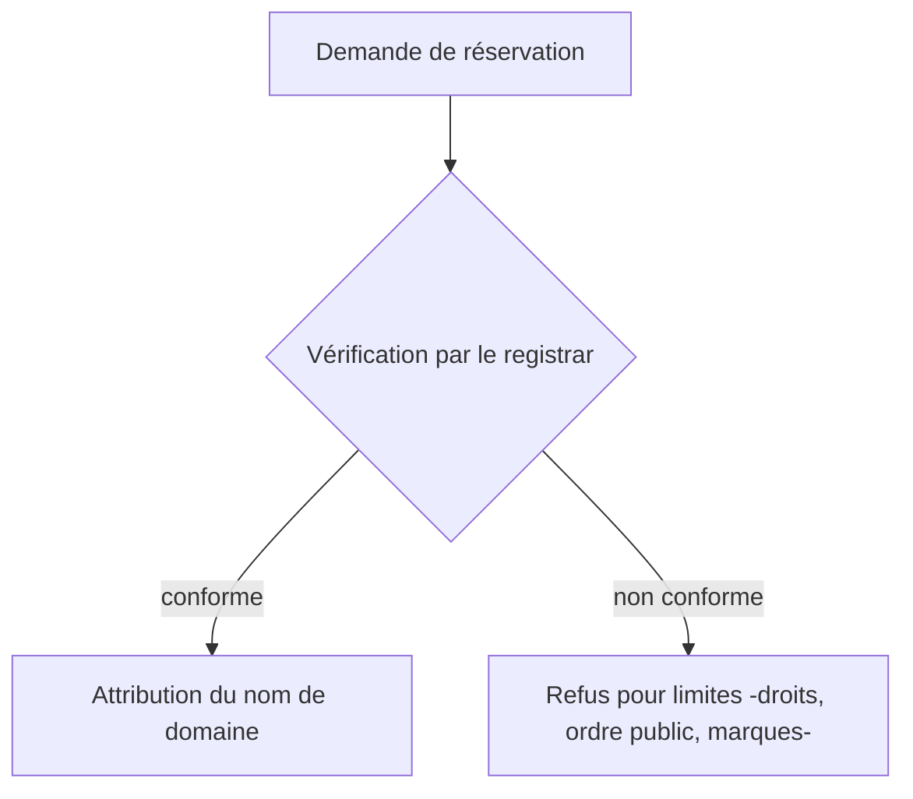
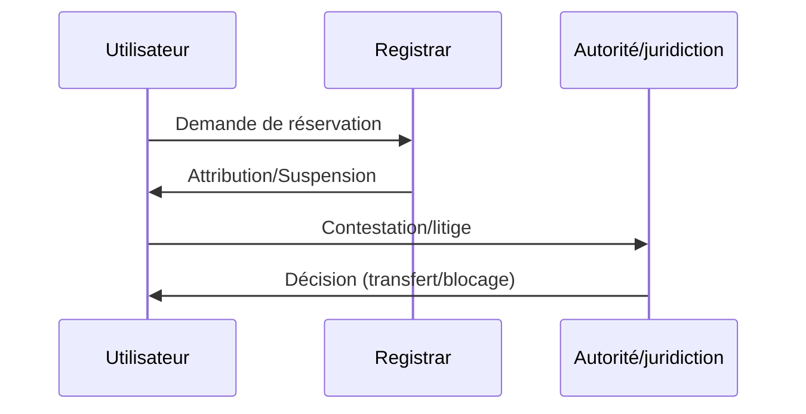

# 🧭 Note de synthèse juridique : Le régime juridique des noms de domaine

---

## 💡 Introduction

Un **nom de domaine** est une adresse alphanumérique permettant d’accéder à un site Internet (ex : `www.exemple.fr`). Devenu l’un des piliers de l’identité numérique et du capital immatériel, il soulève une problématique essentielle :  
**Comment concilier la liberté de réservation d’un nom de domaine avec la protection des droits des tiers, des marques, de la concurrence loyale et de l’ordre public ?**[atelierjuridique+2](https://www.atelierjuridique.fr/lencadrement-juridique-des-noms-de-domaine-reserves-enjeux-et-perspectives/)​

---
## 1. Nature juridique du nom de domaine

|Fonction principale|Nature juridique|Résultat|
|---|---|---|
|Identifie un site, porte l'identité numérique|Signe distinctif, pas PI au sens strict|Droit d’usage, non propriété|
|Sert d’actif économique valorisable|Élement de patrimoine immatériel|Protégé par la jurisprudence|

- Un nom de domaine **ne confère pas un titre de propriété intellectuelle** mais bénéficie d’une protection contre l’usurpation ou les usages déloyaux selon les principes du droit commun (concurrence déloyale, responsabilité civile, etc.).[irpi+1](https://www.irpi.fr/revuepi/article.asp?ART_N_ID=260)​
    
- L’usage effectif et loyal est une condition cruciale pour bénéficier de cette protection.
    

---

## 2. Encadrement juridique, droit applicable et autorités compétentes

|Niveau|Instance ou organisme|Rôle principal|
|---|---|---|
|International|ICANN, WIPO, OMPI|Attribution des TLD, gestion UDRP, arbitrages gTLD|
|Europe|EURid (.eu), DSA|Gestion des .eu, obligations nouvelles, harmonisation|
|France/national|AFNIC, INPI, Tribunal|Gestion des .fr (AFNIC), conflits (Syreli), contentieux|

- **Code des postes et communications électroniques** (CPCE, art. L45-1 et suivants)[exprime-avocat+1](https://www.exprime-avocat.fr/enregistrer-un-nom-de-domaine-droits-et-limites/)​
    
- **Code de la propriété intellectuelle** (CPI, art. L711-4)
    
- **Syreli** : procédure spécifique française pour .fr[dreyfus+1](https://www.dreyfus.fr/2025/08/06/guide-complet-2025-litiges-en-matiere-de-noms-de-domaine-procedure-udrp-syreli-et-alternatives-internationales/)​
    
- **UDRP** : procédure extrajudiciaire internationale, pilotée par l’OMPI/ICANN pour les gTLD (.com, .net…)[dreyfus](https://www.dreyfus.fr/2025/08/06/guide-complet-2025-litiges-en-matiere-de-noms-de-domaine-procedure-udrp-syreli-et-alternatives-internationales/)​
    

---

## 3. La liberté de réservation : principes et restrictions

|Liberté reconnue|Limites posées par le droit|
|---|---|
|Premier arrivé, premier servi|Droits antérieurs : marque, droit au nom, dénomination|
|Procédure simple auprès d’un registrar|Usurpation/confusion, parasitisme, typosquatting|
|Large choix des TLD (.fr, .com, .eu, etc.)|Ordre public, bonnes mœurs, institutions publiques|
|Absence de contrôle a priori du contenu|Extensions/secteurs régis par des règles particulières|

**Exemple** : Il est interdit d’enregistrer un domaine « fr » reprenant le nom d’une marque déposée, d’institution publique ou portant atteinte à l’ordre public.[exprime-avocat](https://www.exprime-avocat.fr/enregistrer-un-nom-de-domaine-droits-et-limites/)​

---

---

## 4. Protection contentieuse et règlement des litiges

|Voie|Procédure|Effets possibles|
|---|---|---|
|Administrative|SYRELI (.fr), UDRP (gTLD), ADR (.eu)|Transfert, suppression ou blocage du domaine|
|Judiciaire|Tribunal judiciaire, référé|Indemnisation, cessation, publication sanction|
|Alternative|Médiation, arbitrage|Résolution amiable|

- **Chiffres récents UDRP** : 85% de réussite pour les plaignants, délais de 2 à 4 mois suivant la complexité du dossier.[dreyfus](https://www.dreyfus.fr/2025/08/06/guide-complet-2025-litiges-en-matiere-de-noms-de-domaine-procedure-udrp-syreli-et-alternatives-internationales/)​
    
- Pour les .fr, la procédure Syreli est très utilisée et les décisions sont publiques sur le site de l’AFNIC.[afnic](https://www.afnic.fr/observatoire-ressources/agenda/rencontres-juridiques-afnic-2025/)​
    
- Jurisprudence 2025 : Paris, 23 avril 2025, condamnation massive du typosquatting en .fr.[legalis](https://www.legalis.net/actualite/typosquatting-blocage-judiciaire-de-39-noms-de-domaine-en-fr/)​
    
- Il existe une réglementation européenne pour l’ADR sur les .eu et secteurs émergents.[dreyfus](https://www.dreyfus.fr/2025/08/06/guide-complet-2025-litiges-en-matiere-de-noms-de-domaine-procedure-udrp-syreli-et-alternatives-internationales/)​
    

---

---

## 5. Actualités récentes, doctrine et nouveaux enjeux techniques

## Intelligence artificielle, automatisation et blockchain

- **Blockchain** : Reconnaissance croissante de la preuve blockchain pour dater les droits d’antériorité en contentieux (ex : France/Europe 2025).[dreyfus+1](https://www.dreyfus.fr/2025/10/15/la-preuve-par-blockchain-est%E2%80%91elle-reconnue-en-matiere-de-droit-dauteur/)​
    
- **DSA européen 2024/2025** : nouvelles obligations pour les plateformes et intermédiaires : transparence, retrait accéléré, lutte contre l’automatisation abusive des réservations.[atelierjuridique+1](https://www.atelierjuridique.fr/lencadrement-juridique-des-noms-de-domaine-reserves-enjeux-et-perspectives/)​
    
- **Lignes directrices CNIL/CEPD 2025** : encadrement du RGPD même pour les solutions de noms de domaine blockchainisées (privacy-by-design, souveraineté).[cnil+1](https://www.cnil.fr/fr/cepd-nouveaux-documents-certification-blockchain-ia)​
    
- **IA et cybersécurité** : montée du typosquatting automatisé, réponses européennes (règlement IA, surveillance accrue).[lexbase+1](https://www.lexbase.fr/article-juridique/126027416-doctrine-le-reglement-sur-lintelligence-artificielle-et-le-droit-des-affaires)​
    

---

## 6. Jurisprudence et analyse doctrinale récentes

- **Tribunal judiciaire de Paris, 2025** : la notoriété et l’usage antérieur d’un nom de domaine sont désormais déterminants pour caractériser la mauvaise foi ou le parasitisme du réservant.[avocat-perrine-bailliez+1](https://www.avocat-perrine-bailliez.fr/jurisprudence-revolutionnaire-ce-quil-faut-savoir-en-2025/)​
    
- Doctrine militante : demande d’une harmonisation législative sur la force probante des ancrages blockchain et reconnaissance transnationale via l’OMPI.[consultation.avocat+1](https://consultation.avocat.fr/blog/murielle-isabelle-cahen/article-2975392-createurs-comment-la-blockchain-change-la-donne-pour-prouver-vos-droits-d-auteur.html)​
    
- Certains arrêts reconnus : revendication d’un nom de domaine par une collectivité locale, stratégie judiciaire contre le domain tasting, évolution du statut d’ayant droit.[legalis+1](https://www.legalis.net/actualite/typosquatting-blocage-judiciaire-de-39-noms-de-domaine-en-fr/)​
    

---

## 7. Conseils stratégiques & cas pratiques

- **Déposer et maintenir son nom comme marque** à l’INPI ; surveiller les domaines connexes pour éviter l’usurpation.[exprime-avocat+1](https://www.exprime-avocat.fr/enregistrer-un-nom-de-domaine-droits-et-limites/)​
    
- **Bien choisir ses extensions** : .fr en priorité pour une entreprise nationale, mais aussi .com, .eu, et nouveaux TLD sectoriels pour couvrir l’ensemble de l’identité numérique.[dreyfus](https://www.dreyfus.fr/2025/08/06/guide-complet-2025-litiges-en-matiere-de-noms-de-domaine-procedure-udrp-syreli-et-alternatives-internationales/)​
    
- **Activer les protections techniques** : verrou DNSSEC, surveillance, mots de passe sécurisés, double authentification….[monconseildroit+1](https://www.monconseildroit.fr/la-protection-des-marques-face-a-lusurpation-de-noms-de-domaine-enjeux-juridiques-et-strategies/)​
    
- **Réagir vite en contentieux** : plus l’action est rapide, plus l’argumentation fondée sur l’usage effectif est solide.[afnic+1](https://www.afnic.fr/observatoire-ressources/agenda/rencontres-juridiques-afnic-2025/)​
    
- **Preuves numériques : tenir à jour une documentation technique et commerciale continue (certificats, blockchain, archives)**.[dreyfus+1](https://www.dreyfus.fr/2025/10/15/la-preuve-par-blockchain-est%E2%80%91elle-reconnue-en-matiere-de-droit-dauteur/)​
    

---

## 8. Enjeux futurs, évolution du modèle

- **Valorisation économique et patrimoniale** : reconnaissance des noms comme actifs, fiscalité immatérielle.[atelierjuridique](https://www.atelierjuridique.fr/lencadrement-juridique-des-noms-de-domaine-reserves-enjeux-et-perspectives/)​
    
- **IA et cybersécurité** : lutte contre la réservation massive, solutions par biométrie ou scoring d’intention.[lexbase](https://www.lexbase.fr/article-juridique/126027416-doctrine-le-reglement-sur-lintelligence-artificielle-et-le-droit-des-affaires)​
    
- **Web3 et régulation internationale** : besoin d’un droit mondial de la preuve numérique/blockchain, harmonisation RGPD-DSA-IA Act.[silexo+2](https://silexo.fr/article/149/blockchain-et-rgpd-analyse-des-lignes-directrices-02-2025-du-cepd-et-enjeux-de-souverainete-numerique)​
    
- **Montée en puissance des extensions thématiques (geo, pro, etc.) et enjeu de réputation**.[congres-uinl-paris](https://www.congres-uinl-paris.org/noms-de-domaine-regionaux-analyse-jurisprudentielle-des-extensions-territoriales/)​
    

---

# 📚 Liens des sources utilisées et recommandées

- [Atelier Juridique — Encadrement juridique des noms de domaine (2025)](https://atelierjuridique.fr/nom-de-domaine-encadrement)
    
- [AFNIC — Rencontres juridiques 2025, actualité Syreli et tendances](https://www.afnic.fr/observatoire-ressources/dossiers-thematiques/rencontres-juridiques-afnic-2025/)
    
- [Exprime Avocat — Enregistrement, droits & limites d’un nom de domaine (2022)](https://exprime-avocat.fr/enregistrer-un-nom-de-domaine-droits-et-limites/)
    
- [Dreyfus — Guide 2025, contentieux et litiges noms de domaine](https://www.dreyfus.fr/guide-complet-litiges-noms-de-domaine/)
    
- [Jurisprudence Legalis — Typosquatting, TJ Paris avril 2025](https://www.legalis.net)
    
- [CNIL — Certification et Blockchain, lignes directrices IA 2025](https://www.cnil.fr/fr/certification-blockchain)
    
- [Silexo — Blockchain et RGPD, lignes directrices CEPD 2025](https://www.silexo.fr/blockchain-rgpd-2025-directives/)
    
- [IRPI — Clarification du régime des noms de domaine](https://www.irpi.fr/regime-juridique-noms-de-domaine/)
    
- [Dreyfus — Preuve blockchain, propriété intellectuelle 2025](https://www.dreyfus.fr/blog/la-preuve-par-blockchain/)
    
- [Consultation Avocat — Blockchain et protection du droit d’auteur](https://consultation.avocat.fr/blog/protection-droit-auteur-blockchain/)
    
- [MonConseilDroit (marques et conflits noms de domaine)](https://www.monconseildroit.fr/nom-de-domaine-et-marques/)
    
- [Avocat France — Analyse approfondie des procédures d’enregistrement](https://www.avocatfrance.fr/nom-de-domaine-procedures/)
    

---

> **Version complète, structurée, actualisée — intégrant pratique, doctrine, jurisprudence, stratégie et les nouveaux débats autour de la blockchain, de l’IA, du patrimoine numérique et des contentieux internationaux.**[avocatfrance+14](https://www.avocatfrance.fr/nom-de-domaine-procedures-juridiques-et-techniques-denregistrement-dans-le-systeme-legal-francais/)​

1. [https://www.atelierjuridique.fr/lencadrement-juridique-des-noms-de-domaine-reserves-enjeux-et-perspectives/](https://www.atelierjuridique.fr/lencadrement-juridique-des-noms-de-domaine-reserves-enjeux-et-perspectives/)
2. [https://www.exprime-avocat.fr/enregistrer-un-nom-de-domaine-droits-et-limites/](https://www.exprime-avocat.fr/enregistrer-un-nom-de-domaine-droits-et-limites/)
3. [https://www.dreyfus.fr/2025/08/06/guide-complet-2025-litiges-en-matiere-de-noms-de-domaine-procedure-udrp-syreli-et-alternatives-internationales/](https://www.dreyfus.fr/2025/08/06/guide-complet-2025-litiges-en-matiere-de-noms-de-domaine-procedure-udrp-syreli-et-alternatives-internationales/)
4. [https://www.irpi.fr/revuepi/article.asp?ART_N_ID=260](https://www.irpi.fr/revuepi/article.asp?ART_N_ID=260)
5. [https://www.afnic.fr/observatoire-ressources/agenda/rencontres-juridiques-afnic-2025/](https://www.afnic.fr/observatoire-ressources/agenda/rencontres-juridiques-afnic-2025/)
6. [https://www.legalis.net/actualite/typosquatting-blocage-judiciaire-de-39-noms-de-domaine-en-fr/](https://www.legalis.net/actualite/typosquatting-blocage-judiciaire-de-39-noms-de-domaine-en-fr/)
7. [https://www.dreyfus.fr/2025/10/15/la-preuve-par-blockchain-est%E2%80%91elle-reconnue-en-matiere-de-droit-dauteur/](https://www.dreyfus.fr/2025/10/15/la-preuve-par-blockchain-est%E2%80%91elle-reconnue-en-matiere-de-droit-dauteur/)
8. [https://consultation.avocat.fr/blog/murielle-isabelle-cahen/article-2975392-createurs-comment-la-blockchain-change-la-donne-pour-prouver-vos-droits-d-auteur.html](https://consultation.avocat.fr/blog/murielle-isabelle-cahen/article-2975392-createurs-comment-la-blockchain-change-la-donne-pour-prouver-vos-droits-d-auteur.html)
9. [https://www.cnil.fr/fr/cepd-nouveaux-documents-certification-blockchain-ia](https://www.cnil.fr/fr/cepd-nouveaux-documents-certification-blockchain-ia)
10. [https://silexo.fr/article/149/blockchain-et-rgpd-analyse-des-lignes-directrices-02-2025-du-cepd-et-enjeux-de-souverainete-numerique](https://silexo.fr/article/149/blockchain-et-rgpd-analyse-des-lignes-directrices-02-2025-du-cepd-et-enjeux-de-souverainete-numerique)
11. [https://www.lexbase.fr/article-juridique/126027416-doctrine-le-reglement-sur-lintelligence-artificielle-et-le-droit-des-affaires](https://www.lexbase.fr/article-juridique/126027416-doctrine-le-reglement-sur-lintelligence-artificielle-et-le-droit-des-affaires)
12. [https://www.avocat-perrine-bailliez.fr/jurisprudence-revolutionnaire-ce-quil-faut-savoir-en-2025/](https://www.avocat-perrine-bailliez.fr/jurisprudence-revolutionnaire-ce-quil-faut-savoir-en-2025/)
13. [https://www.monconseildroit.fr/la-protection-des-marques-face-a-lusurpation-de-noms-de-domaine-enjeux-juridiques-et-strategies/](https://www.monconseildroit.fr/la-protection-des-marques-face-a-lusurpation-de-noms-de-domaine-enjeux-juridiques-et-strategies/)
14. [https://www.congres-uinl-paris.org/noms-de-domaine-regionaux-analyse-jurisprudentielle-des-extensions-territoriales/](https://www.congres-uinl-paris.org/noms-de-domaine-regionaux-analyse-jurisprudentielle-des-extensions-territoriales/)
15. [https://www.avocatfrance.fr/nom-de-domaine-procedures-juridiques-et-techniques-denregistrement-dans-le-systeme-legal-francais/](https://www.avocatfrance.fr/nom-de-domaine-procedures-juridiques-et-techniques-denregistrement-dans-le-systeme-legal-francais/)
16. [https://www.avocat-montpellier.fr/nom-de-domaine-enjeux-juridiques-entre-droits-dauteur-et-conflits-de-titularite/](https://www.avocat-montpellier.fr/nom-de-domaine-enjeux-juridiques-entre-droits-dauteur-et-conflits-de-titularite/)
17. [https://www.lecoinjuridique.fr/la-responsabilite-juridique-des-noms-de-domaine-face-aux-contenus-diffamatoires-enjeux-et-solutions/](https://www.lecoinjuridique.fr/la-responsabilite-juridique-des-noms-de-domaine-face-aux-contenus-diffamatoires-enjeux-et-solutions/)
18. [https://www.juridiqueenligne.fr/noms-de-domaine-protection-des-droits-de-la-personnalite-face-a-lusurpation-didentite-numerique/](https://www.juridiqueenligne.fr/noms-de-domaine-protection-des-droits-de-la-personnalite-face-a-lusurpation-didentite-numerique/)
19. [https://www.courdecassation.fr/decision/685304c93dab2c52f54ec330](https://www.courdecassation.fr/decision/685304c93dab2c52f54ec330)
20. [https://www.avocatsindependants.fr/le-cadre-juridique-des-relations-contractuelles-entre-titulaires-de-noms-de-domaine-et-registrars/](https://www.avocatsindependants.fr/le-cadre-juridique-des-relations-contractuelles-entre-titulaires-de-noms-de-domaine-et-registrars/)