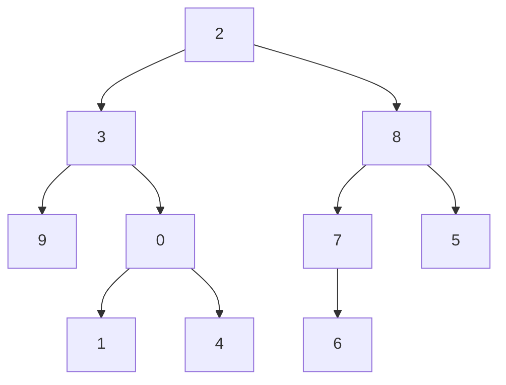

**Cours** : [[Permanent/Cours/Cours/Semestre 5/Qualité algorithmique|Qualité algorithmique]]

# 1. Relations asymptotiques

## a) $f_1(n) = n^2$, $f_2(n) = n^2 + 1$

La fonction $f_2(n) = n^2 + 1$ est équivalente à $f_1(n) = n^2$ pour des grandes valeurs de $n$, car le terme constant $+1$ devient négligeable. On a donc :

- Relation asymptotique : $f_1(n) = \Theta(f_2(n))$

**Conclusion :** $f_1(n) = \Theta(f_2(n))$

---

## b) $f_1(n) = n^2$, $f_2(n) = n^2 + n$

Dans ce cas, $f_2(n) = n^2 + n$ est dominé par $n^2$ pour des grandes valeurs de $n$. Le terme $n$ devient négligeable par rapport à $n^2$. On a donc :

- Relation asymptotique : $f_1(n) = \Theta(f_2(n))$

**Conclusion :** $f_1(n) = \Theta(f_2(n))$

$$lim_{n->+\infty}\frac{f1(n)}{f2(n)}=lim=\frac{n^2}{n^2+n}\frac{1}{1+\frac{1}{n}} = 1$$

---

## c) $f_1(n) = n^2$$f_2(n) = 3n^2 + 4n + 1$

Ici, $f_2(n)$ est une fonction quadratique avec des termes supplémentaires $4n$ et $1$. Toutefois, pour des grandes valeurs de $n$, le terme dominant est $3n^2$. On a donc :

- Relation asymptotique : $f_1(n) = \Theta(f_2(n))$

**Conclusion :** $f_1(n) = \Theta(f_2(n))$

$$lim_{n->+\infty}=\frac{f1(n)}{f2(n)}=lim=\frac{n^2}{3n^2+4n+1}=\frac{1}{3+\frac{4}{n}+\frac{1}{n}}=\frac{1}{3}$$

---

## d) $f_1(n) = 10n^2$, $f_2(n) = n^3$

Dans ce cas, $f_2(n) = n^3$ croît plus vite que $f_1(n) = 10n^2$ à mesure que $n$ devient grand. On a donc :

- Relation asymptotique : $f_1(n) = O(f_2(n))$ et $f_2(n) = \Omega(f_1(n))$

**Conclusion :** $f_1(n) = O(f_2(n))$, $f_2(n) = \Omega(f_1(n))$

$$lim_{n->+\infty}=\frac{f1(n)}{f2(n)}=lim=\frac{10n^2}{n^3}=\frac{10}{n}$$

---

## e) $f_1(n)$ et $f_2(n)$ sont des polynômes positifs de degré $d$ (coefficient de $n^d$ positif)

Si $f_1(n)$ et $f_2(n)$ sont des polynômes de même degré $d$, la relation entre les deux fonctions est déterminée par les coefficients des termes de plus haut degré. Comme les termes dominants sont de même ordre, on a :

- Relation asymptotique : $f_1(n) = \Theta(f_2(n))$

**Conclusion :** $f_1(n) = \Theta(f_2(n))$

---

## f) $f_1(n)$ est un polynôme de degré $d_1$ et $f_2(n)$ est un polynôme de degré $d_2$

Si $f_1(n)$ est un polynôme de degré $d_1$ et $f_2(n)$ est un polynôme de degré $d_2$, la relation entre les deux fonctions dépend des degrés. Si $d_1 = d_2$, la relation est $\Theta$, mais si $d_1 < d_2$, on a $f_1(n) = O(f_2(n))$, et si $d_1 > d_2$, on a $f_2(n) = O(f_1(n))$.

- Si $d_1 = d_2$, alors $f_1(n) = \Theta(f_2(n))$
- Si $d_1 < d_2$, alors $f_1(n) = O(f_2(n))$
- Si $d_1 > d_2$, alors $f_2(n) = O(f_1(n))$

**Conclusion :** La relation dépend des degrés $d_1$ et $d_2$.


# 2. Simplification asymptotique
## a) $f(n) = 3n + 10$

Le terme dominant est $3n$, donc :

**Réponse :** $\Theta(n)$

---

## b) $f(n) = an + b$  avec $a > 0$

Le terme dominant est $an$, donc :

**Réponse :** $\Theta(n)$

---

## c) $f(n) = 3n^2 + 4n + 1$

Le terme dominant est $3n^2$, donc :

**Réponse :** $\Theta(n^2)$

---

## d) $f(n) = an^2 + bn + c$ avec $a > 0$

Le terme dominant est $an^2$, donc :

**Réponse :** $\Theta(n^2)$

---

## e) $f(n)$ est un polynôme positif de degré $d$ (coefficient de $n^d$ positif)

Le terme dominant est de degré $d$, donc :

**Réponse :** $\Theta(n^d)$

---

## f) $f(n, m) = 3n + 10m$

Les deux termes sont linéaires, donc on garde le maximum :

**Réponse :** $\Theta(n + m)$

---

## g) $f(n, m) = anm + bn + cm + d$ avec $a, b, c > 0$

Le terme dominant est $anm$ (produit croisé), donc :

**Réponse :** $\Theta(nm)$

---

## h) $f(n, m) = \dfrac{3n^2 + 4n + 1}{n + m + nm}$

### Analyse asymptotique :

- Numérateur : $3n^2 + 4n + 1 = \Theta(n^2)$
- Dénominateur : $n + m + nm = \Theta(nm)$ (car $nm$ domine)


# 3) Changer la taille des données
## a) $f(n) = \log_2 n$

On utilise la propriété des logarithmes :  
$\log_2(4n) = \log_2 4 + \log_2 n = 2 + \log_2 n$

**Conclusion :** $f(4n) = f(n) + 2 \quad \Rightarrow \quad f(4n) = \Theta(f(n))$

---

## b) $f(n) = \sqrt{n}$

$\sqrt{4n} = \sqrt{4} \cdot \sqrt{n} = 2\sqrt{n}$

**Conclusion :** $f(4n) = 2f(n)$

---

## c) $f(n) = n$

$f(4n) = 4n = 4f(n)$

**Conclusion :** $f(4n) = 4f(n)$

---

## d) $f(n) = n^2$

$f(4n) = (4n)^2 = 16n^2 = 16f(n)$

**Conclusion :** $f(4n) = 16f(n)$

---

## e) $f(n) = n^3$

$f(4n) = (4n)^3 = 64n^3 = 64f(n)$

**Conclusion :** $f(4n) = 64f(n)$

---

## f) $f(n) = 2^n$

$f(4n) = 2^{4n} = (2^n)^4 = f(n)^4$

**Conclusion :** $f(4n) = f(n)^4$ (croissance exponentielle très rapide)

# 7) Petites et grandes boucles

## a) Boucle simple de 0 à $n$
- La boucle s'excute N fois

=> Ordre de temps : $O(N)$

## b) Boucle de $N$ à $0$ par pas de 2
- Nombre d'itérations environ $\frac{N}{2}$ fois

=> Ordre de temps : $O(N)$

## c) Boucles imbriquées
- Boucle extérieure fait $N$ itérations, boucle intérieure aussi
- Total : $N*N=N^2$

Ordre de temps : $O(N^2)$

## d) 
- Pour $I=1$ à $N$ : La boucle intérieure fait $I$ itérations
- Total : $1+2+3+...+N=\frac{N(N+1)}{2}$

=> Ordre de temps : $O(N^2)$

## e)
- Valeurs de $I$ : $1, 2, 4, 8, ..., \leq N$
- Nombre d'itérations : $log_2N$

=> Ordre de temps : $O(log\space N)$

## f)
- Valeurs de $I$ : $N, \frac{N}{2}, \frac{N}{4}, ..., 1$
- Nombre d'itérations : $log_2N$

=> Ordre de temps : $O(log\space N)$

## g)
- Pour chaque $I$, la boucle intérieure fait environ $log_2I$ itérations
- Total : $\sum_{I=1}^Nlog\space I = NlogN$

=> Ordre de temps : $O(NlogN)$

## h)
- Limite extérieure : $log_2N$ itérations (car $I$ multiplié par 2)
- Pour $I=1, 2, 4, ..., N$, la boucle effectue  $I$ incréments
- Total : $1+2+4+...+N=2N-1=O(N)$

=> Ordre de temps  : $O(N)$

# 11)
## a)
C'est une suite aithmétique de raison $5$
$$x(n)=5n-5 <=> 5(n-1)$$

## b)
$x(2)=12$
$x(3)=36$
Suite géométrique de raison $3$

Ainsi, $x(n)=x(1)3^{n-1}=4*3^{n-1}$

# c)
$x(0)=0$
$x(1)=1$
$x(2)=3$
$x(3)=6$
$x(4)=10$

$$\sum_{i=0}^{i=n}i=\frac{n(n+1)}{2}$$
Ainsi : 
$$x(n)=\frac{n(n+1)}{2}$$


# 14) 

## Algorithme

```
Algorithme Devine(n)  
	Entrée : un entier positif n  
		if n = 1
			return 1  
		else
			return Devine(n - 1) + 2 * n - 1
```


---

## a. Équation de récurrence pour la valeur calculée

On note **T(n)** la valeur retournée par `Devine(n)`.

- Cas de base :  
  $T(1) = 1$

- Récurrence :  
  $T(n) = T(n-1) + 2n - 1$, pour $n > 1$

### Résolution
$$T(n) = T(1) + \sum_{k=2}^{n} (2k - 1) = 1 + (n^2 - 1) = n^2$$

✅ **Conclusion** : l’algorithme calcule $n^2$.

---

## b. Équation de récurrence pour les multiplications

On note **M(n)** le nombre de multiplications effectuées.

- Cas de base :  
  $M(1) = 0$ (aucune multiplication)

- Récurrence :  
  $M(n) = M(n-1) + 1$

### Résolution
$$M(n) = n - 1$$

---

## c. Équation de récurrence pour les additions/soustractions

On note **A(n)** le nombre d’additions/soustractions effectuées.

- Cas de base :  
  $A(1) = 0$

- Récurrence :  
  à chaque appel $(n > 1$) :  
  • 1 addition $(T(n-1) + (2n - 1)$)  
  • 1 soustraction $(2n - 1$)  

Donc :
$$A(n) = A(n-1) + 2$$

### Résolution
$$A(n) = 2(n-1)$$

---

## Résumé des résultats

| Élément                 | Équation de récurrence              | Solution         |
| ----------------------- | ----------------------------------- | ---------------- |
| Valeur calculée $T(n)$ | $T(n) = T(n-1) + 2n - 1,\; T(1)=1$ | $T(n) = n^2$    |
| Multiplications $M(n)$ | $M(n) = M(n-1) + 1,\; M(1)=0$      | $M(n) = n - 1$  |
| Add./Soustr. $A(n)$    | $A(n) = A(n-1) + 2,\; A(1)=0$      | $A(n) = 2(n-1)$ |

---

✅ L’algorithme calcule donc **$n^2$** en effectuant **$n-1$** multiplications et **$2(n-1)$** additions/soustractions.

# 44)

## 1)

```java
MinMax(tab)
	n <- longueur(tab)
	Si n = 1
		Retourner(tab[0], tab[0])
	Sinon si n = 2
		Si tab[0] < tab[1]
			Retourner(tab[0], tab [1])
		Sinon
			Retourner(tab[1], tab[0])
	Sinon
		Milieu = n/2
		(minG, maxG) = MinMax(tab[0:Milieu])
		(minD, maxD) = MinMax(tab[Milieu, n])
		minTotal = min(minG, minD)
		maxTotal = max(maxG, maxD)
		return(minTotal, maxTotal)
FinFonction
```

## 2)
- Pour 1 élément : 0 comparaisons
- Pour 2 éléments : 1 comparaison
- Pour n élément : Quand le tableau est divisé en 2, il faut deux appels récursifs et 2 comparaisons pour comparer les minima et maxima des deux sous tableaux. Ainsi :
$$T[n]\begin{cases}0\space si\space n=1\\1\space si\space n=2\\T[\frac{n}{2}]+T[\frac{n}{2}]+2\space si\space n>1\end{cases}$$
Ainsi, quand $n$ est une puissance de 2, le nombre de comparaisons son : $T(n)=\frac{3n}{2}-2$

# 3)
Ce résultat est optimal et inférieur au nombre de comparaisons du parcours (force brute) qui effectue $2n−2$ comparaisons au pire.

# Tours de Hanoi
Algorithme :

```java
Hanoi(n, source, destination, intermédiaire)
	Si n=0
		Retourner
	Sinon si n=1
		Deplacer(source, destination)
	Sinon
		Hanoi()


```

# 55)
**Préfixé** : a - b - d - e - c - f
**Infixé** : d - e - f - b - c - a
**Posfixé** : a - c - f - b - e - d

# 56)




# 27)

```pseudo
fonction parcoursDecroissant(noeud)
    si noeud == null alors
        retourner
    fin si

    parcoursDecroissant(noeud.droite)  // parcourir le sous-arbre droit (valeurs grandes)
    imprimer(noeud.valeur)            // afficher la valeur du noeud
    parcoursDecroissant(noeud.gauche) // parcourir le sous-arbre gauche (valeurs petites)
fin fonction
```

# 81)

