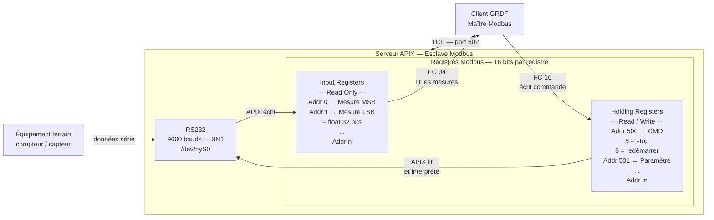

## Modbus — Explication complète basée sur ton schéma

---

### Le contexte : à quoi sert ce système ?

APIX est un serveur Modbus qui fait le lien entre un équipement physique terrain (un compteur de gaz par exemple, côté GRDF) et un réseau TCP. Il traduit les données séries RS232 en registres Modbus accessibles via le réseau.

---

### Les deux acteurs : maître et esclave

Modbus fonctionne toujours selon un modèle **maître / esclave**. Le maître pose des questions, l'esclave répond. L'esclave ne parle jamais en premier.

Dans ton schéma, **APIX est l'esclave** et le **client GRDF est le maître**. Le client interroge APIX via TCP sur le port 502. C'est lui qui décide quand lire les données et quand envoyer des commandes.

---

### La liaison série RS232 côté terrain

Avant d'arriver sur le réseau, les données viennent du terrain via une liaison série RS232. Les paramètres de cette liaison sont configurés dans `network.json` :

- **Baud rate** : vitesse de transmission, ici 9600 bauds
- **Bits** : 8 bits de données par trame
- **Parité** : N (aucune)
- **Stops** : 1 bit de stop

Ces paramètres doivent être identiques des deux côtés du câble — APIX et l'équipement terrain — sinon ils ne se comprennent pas.

---

### Les deux tables de registres

C'est le cœur du schéma. APIX expose deux zones mémoire distinctes, chacune avec un rôle précis. Chaque registre fait **16 bits**. Pour stocker une valeur plus grande ou plus précise (un float par exemple), on utilise deux registres consécutifs — ce qui donne 32 bits.

---

### Input Registers — lecture seule

C'est APIX qui remplit ces registres avec les données reçues du terrain. Le client GRDF peut uniquement les **lire** — il n'a aucun droit d'écriture. Le flux va dans un seul sens : terrain → APIX → client.

Pour une mesure en float 32 bits, on utilise deux registres : l'adresse 0 contient les 16 bits de poids fort (MSB) et l'adresse 1 les 16 bits de poids faible (LSB). Le client lit les deux d'un coup et reconstitue la valeur complète.

Le code fonction utilisé par le client pour lire ces registres est **FC 04** (Read Input Registers).

---

### Holding Registers — lecture et écriture

C'est l'inverse. Le client GRDF **écrit** dans ces registres pour envoyer des commandes à APIX. APIX les surveille en permanence et interprète ce qu'il y trouve. Par exemple, si le client écrit la valeur `5` dans le registre 500, APIX comprend que c'est un ordre de stop et envoie la commande correspondante à l'équipement via RS232.

Le code fonction utilisé pour écrire est **FC 16** (Write Multiple Registers).

---

### La configuration `network.json`

Ce fichier pilote toutes les interfaces de communication d'APIX. Les points clés :

- `tcp.enabled: true` et `tcp.port: 502` — APIX écoute les connexions Modbus TCP sur le port standard
- `serial.bauds / bits / parity / stops` — paramètres de la liaison RS232 avec le terrain
- `serial.enabled: false` sur les deux ports — la liaison série est pour l'instant désactivée
- `slave_id: 0` — identifiant d'APIX sur le réseau Modbus
- `zmq_data_port: 5556` et `zmq_command_port: 5557` — communication interne entre les processus d'APIX (invisible depuis l'extérieur)

---

### Le flux complet de bout en bout

L'équipement terrain envoie une mesure en RS232 → APIX la reçoit et l'écrit dans ses Input Registers → le client GRDF interroge APIX via TCP port 502 avec FC 04 et lit les valeurs → le client décide d'envoyer une commande → il écrit `5` dans le Holding Register 500 avec FC 16 → APIX détecte le changement et envoie l'ordre stop à l'équipement via RS232.