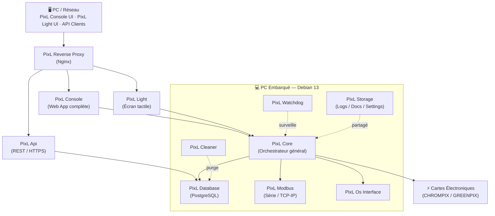
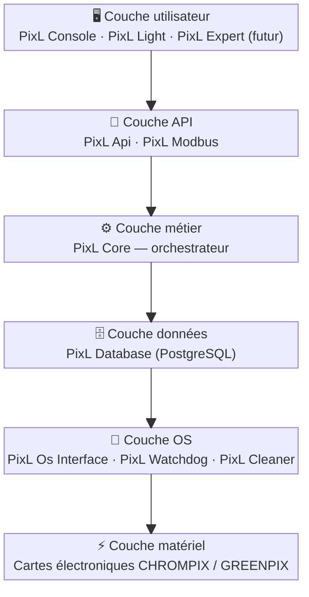

# Apix Analytics — Présentation Entreprise

---

## 🏢 Qui est Apix Analytics ?

Apix Analytics est une entreprise spécialisée dans le développement de **logiciels embarqués pour analyseurs de gaz chromatographiques** (CHROMPIX, GREENPIX). Elle conçoit et maintient l'ensemble de la suite logicielle **PixL Suite**, qui pilote ces analyseurs industriels depuis la collecte des données jusqu'à la présentation des résultats aux utilisateurs finaux.

---

## 🧩 La PixL Suite — Vue d'ensemble

La **PixL Suite** est la suite logicielle unifiée d'Apix. Elle regroupe l'ensemble des logiciels qui font fonctionner les analyseurs, de la couche matérielle jusqu'à l'interface utilisateur.

---

## 📦 Les logiciels de la PixL Suite — Détail

### 🔵 PixL Core

**Rôle :** Orchestrateur général de l'analyseur.

- Gère la communication avec les cartes électroniques de l'analyseur
- Pilote le processing des chromatogrammes (traitement des signaux)
- Assure la coordination entre tous les modules internes
- Déployé directement sur Debian 13 (PC embarqué)

---

### 🟢 PixL Console

**Rôle :** Interface web complète pour les utilisateurs avancés.

- Application web accessible depuis un navigateur (local ou distant)
- Donne accès aux commandes, configurations et résultats de l'analyseur
- Permet la calibration semi-automatique, la gestion des méthodes, la visualisation des chromatogrammes
- Disponible en **français, anglais et polonais**
- En cours de refonte vers **PixL Expert** (interface nouvelle génération basée sur Vue.js)

---

### 🟡 PixL Light

**Rôle :** Interface web simplifiée, optimisée pour l'écran tactile.

- Lancée depuis la dalle tactile des analyseurs CHROMPIX
- Affiche les résultats principaux, les tendances, les alarmes et l'audit-trail
- Version allégée de PixL Console, adaptée à un usage terrain rapide

---

### 🔴 PixL Api

**Rôle :** API REST sécurisée (HTTPS).

- Accessible en interne (par les autres logiciels Apix) et en externe (par les clients via API)
- Permet l'accès sécurisé à la base de données
- Documentée via **Swagger**
- Sert de passerelle entre PixL Core et les applications tierces

---

### 🟣 PixL Modbus

**Rôle :** Communication protocole Modbus.

- Expose les données de l'analyseur via le protocole **Modbus** (série et TCP/IP simultanément)
- Permet l'intégration avec des systèmes industriels tiers (automates, SCADA…)
- Déployé dans un conteneur Docker

---

### ⚙️ PixL Os Interface

**Rôle :** Interface avec le système d'exploitation.

- Assure la communication entre les logiciels PixL et le système Debian embarqué
- Gère les interactions bas niveau avec l'OS

---

### 🛡️ PixL Watchdog

**Rôle :** Surveillance des processus.

- Surveille le bon fonctionnement des autres modules
- Redémarre automatiquement les services en cas de défaillance

---

### 🗄️ PixL Database

**Rôle :** Gestion de la base de données.

- Basé sur **PostgreSQL**, déployé en conteneur Docker
- Stocke toutes les données de l'analyseur (résultats, configurations, audit-trail…)
- Accédé via la librairie interne **Apix Database**

---

### 🧹 PixL Cleaner

**Rôle :** Nettoyage et maintenance des données.

- Purge automatiquement les données obsolètes
- Maintient les performances de la base de données

---

### 📦 PixL Storage

**Rôle :** Gestionnaire de fichiers partagés.

- Centralise les dossiers de Logs, Documentation et Settings communs à tous les logiciels
- Fournit un accès SFTP en lecture seule pour les clients externes

---

### 🔧 PixL Auto Tune

**Rôle :** Outil de calibration automatisée (production).

- Utilisé en production pour calibrer et vérifier les systèmes des analyseurs
- Guide l'opérateur à travers les étapes : sélection des données, des standards, ajustement des pics, vérification de l'intégration, résultats de calibration
- En production depuis l'automne 2025 pour les analyseurs de 2ème génération

---

## 🔗 Comment les logiciels sont-ils reliés ?

| Logiciel          | Communique avec      | Via                                   |
| ----------------- | -------------------- | ------------------------------------- |
| PixL Console      | PixL Core            | PixL Reverse Proxy → PixL Console Api |
| PixL Light        | PixL Core            | PixL Reverse Proxy (accès direct)     |
| PixL Api          | PixL Database        | Librairie **Apix Database** (interne) |
| PixL Core         | Cartes électroniques | Communication bas niveau (Firewall)   |
| PixL Core         | PixL Database        | Librairie **Apix Database**           |
| PixL Modbus       | PixL Core            | Interface Modbus (série / TCP-IP)     |
| PixL Os Interface | Système Debian       | Appels système                        |
| PixL Watchdog     | Tous les modules     | Surveillance processus                |
| PixL Cleaner      | PixL Database        | Requêtes de nettoyage                 |

### Librairies communes (Apix Tools)

Plusieurs logiciels partagent des **librairies communes** pour éviter la duplication de code :

- **Apix Tools** : code utilitaire partagé entre tous les logiciels de la suite
- **Apix Database** : librairie dédiée à la gestion des modèles de base de données, partagée entre PixL Api et PixL Console

---

## 🏗️ Infrastructure technique

|Composant|Technologie|
|---|---|
|OS embarqué|Debian 12 → Debian 13|
|Hardware PC|MIO-5251 → **MIO-5152** (chiffrement disque, UEFI)|
|Conteneurisation|**Docker** (PixL Console, Modbus, Database, Light, Api, Nginx)|
|Base de données|**PostgreSQL**|
|Reverse Proxy|**Nginx** (conteneur `pixl-nginx`)|
|Signature logicielle|**SHA-256** (tous les logiciels PixLSuite 2026.X)|
|Vulnérabilités|Rapport automatique généré à chaque build|
|Packaging|Outil unifié **PixL Suite Packaging GUI**|

---

## 🚀 Projets en cours et à venir

### PixL Expert (futur remplacement de PixL Console)

- Séparation backend/frontend
- Frontend migré en **Vue.js**
- Nouvelle interface moderne avec bandeau de navigation repensé

### PixL Grafana (POC)

- Tableaux de bord de surveillance de l'analyseur basés sur **Grafana**
- Visualisation des résultats, températures, pressions, alarmes

### PixL Upgrader

- Mise à jour automatique des firmwares des cartes électroniques depuis l'interface PixL Expert

### Conformité Cyber Resilience Act (CRA)

- Projet planifié sur 17 mois (octobre 2025 → septembre 2027)
- 7 lots : gouvernance, analyse de conformité, sécurité par conception, SBOM, surveillance post-commercialisation, audit

---

## 📊 Résumé de la PixL Suite

