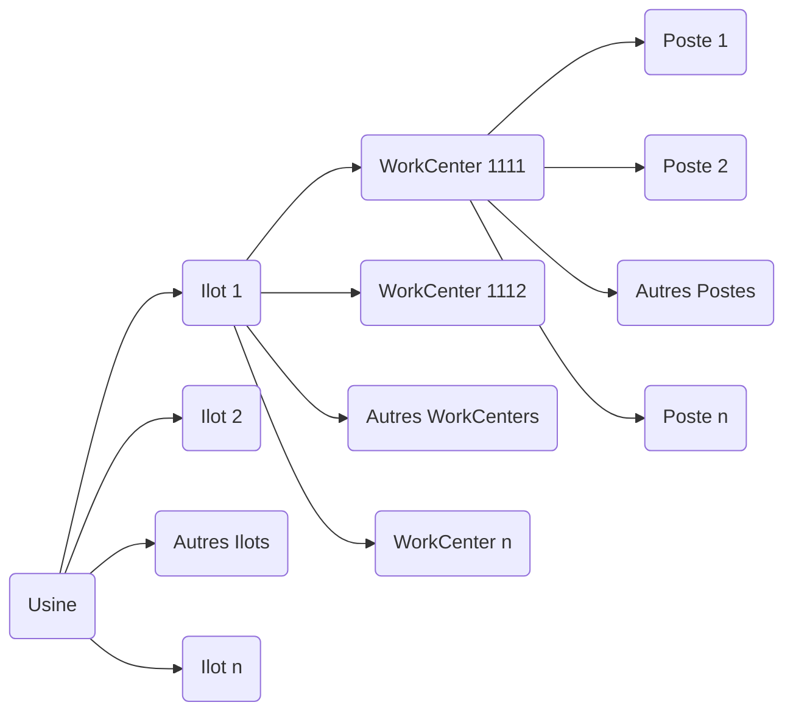

![[Pasted image 20250601140945.png]]

# Rapport de stage

## I. Présentation de l'entreprise

### 1. APIX Analytics — contexte et activité

APIX Analytics est une entreprise grenobloise spécialisée dans le développement de logiciels embarqués pour analyseurs de gaz chromatographiques. Elle conçoit et maintient l'ensemble de la suite logicielle **PixL Suite**, qui pilote ses analyseurs industriels — les **CHROMPIX** et **GREENPIX** — depuis la collecte des données brutes jusqu'à la présentation des résultats aux utilisateurs finaux.

Son activité s'inscrit dans un contexte industriel exigeant, où la fiabilité et la précision des mesures sont primordiales : les analyseurs APIX sont utilisés pour mesurer la composition de gaz industriels dans des environnements variés, tels que des réseaux de distribution de gaz naturel, des sites de production industrielle ou des laboratoires d'analyse.

APIX Analytics est une PME à taille humaine, ce qui implique une organisation agile et une forte polyvalence des équipes. Les développeurs sont amenés à intervenir sur l'ensemble de la pile logicielle, du bas niveau embarqué jusqu'aux interfaces utilisateur web.

---

### 2. Le produit — La PixL Suite

La **PixL Suite** est un ensemble de logiciels interdépendants qui pilotent intégralement les analyseurs APIX. Elle couvre l'intégralité de la chaîne, depuis le traitement des signaux électroniques jusqu'à l'interface utilisateur, en passant par la communication avec des systèmes industriels tiers.

La suite se compose de plusieurs logiciels aux rôles complémentaires : un orchestrateur général déployé sur le PC embarqué de l'analyseur, une API REST sécurisée servant de passerelle vers l'extérieur, un module de communication Modbus permettant l'intégration avec des automates et systèmes SCADA, et des interfaces web permettant aux opérateurs de piloter et configurer l'appareil. L'infrastructure repose sur Docker pour la conteneurisation et PostgreSQL comme base de données.

Parmi ces composants figure **PixL Expert**, une interface web nouvelle génération basée sur Vue.js, actuellement en cours de développement pour moderniser et remplacer l'interface existante. C'est dans ce logiciel que s'inscrit directement mon travail de stage.

---

### 3. L'équipe et mon environnement de travail

Mon stage s'est déroulé dans les locaux d'APIX Analytics à Grenoble, au sein d'un openspace partagé avec l'ensemble de l'équipe de développement. Cette configuration favorise la communication spontanée et facilite les échanges techniques au quotidien.

Ma tutrice de stage est **Élodie Baral-Baron**, qui a assuré le suivi de mon travail et m'a accompagné de manière active tout au long du stage. Loin de me laisser seul face aux difficultés, elle a pris le temps de m'expliquer les aspects techniques du projet au fur et à mesure de mon avancement : le fonctionnement du protocole Modbus, la structure des fichiers de configuration, la signification des différents attributs des registres, ou encore les conventions propres à la codebase d'APIX. Cet encadrement m'a permis de monter en compétence efficacement et d'aborder chaque nouvelle tâche avec une bonne compréhension du contexte. J'ai également bénéficié du soutien de **Sébastien Rattier**, développeur au sein de l'équipe, dont l'aide technique a complété cet accompagnement.

L'organisation du stage reflète bien l'esprit de l'équipe : guidé et soutenu quand j'en avais besoin, mais libre dans la manière d'organiser et de mener mon travail au quotidien. Cette autonomie encadrée a été très formatrice.
## Méthodes de travail et outils

### Versionnage

Nous travaillons sur trois versions distinctes du logiciel, chacune ayant un rôle spécifique dans le cycle de développement :

* **Version de production** : La version la plus stable et éprouvée. Elle est utilisée en environnement réel.
* **Version de test** : Une version intermédiaire, plus récente que la version de production, utilisée pour les tests approfondis.
* **Version de développement** : La version la plus récente, où les nouvelles fonctionnalités et correctifs sont en cours de développement.

### Cycle de mise à jour des versions

Lorsque la version de test est validée et passe en production, les versions évoluent comme suit :

1. La **version de production** prend la place de la version de test.
2. La **version de test** prend la place de la version de développement.
3. Une nouvelle **version de développement** est créée avec un incrément.

```
## Versions initiales :

* Version de production : 2.65  
* Version de test : 2.66  
* Version de développement : 2.67

## Après mise à jour :

* Nouvelle version de production : 2.66 (ancienne version de test)  
* Nouvelle version de test : 2.67 (ancienne version de développement)  
* Nouvelle version de développement : 2.68 (incrémentée).
```

### Organisation physique d'une usine



Cette structure reflète une organisation typique :

* **Usine (Plant)** : Le site global.
* **Ilots (Ilots)** : Regroupements d'équipements ou d'activités similaires
* **WorkCenters** : Zones spécifiques dans un ilot où des processus précis sont effectués.
* **Postes (Workstations)** : Les unités les plus détaillées où les tâches sont réalisées

---

## Fonctionnement des logiciels

Trois logiciels principaux sont utilisés pour gérer et simuler les processus industriels :

| Logiciel               | Fonction principale                                                    | Utilisation en atelier |
| ---------------------- | ---------------------------------------------------------------------- | ---------------------- |
| **Raypro Supervision** | Modélisation et optimisation des chaînes de production complètes       | Oui                    |
| **Raypro Simulator**   | Simulation virtuelle des machines pour le développement et les tests   | Non                    |
| **Raypro Machine**     | Suivi en temps réel des performances et du fonctionnement des machines | Oui                    |

### Détails des logiciels

#### **Raypro Supervision**

Ce logiciel est conçu pour paramétrer et modéliser une chaîne complète de production. Ses principales fonctionnalités incluent :

* Identification des goulets d'étranglement et des inefficacités.
* Optimisation des flux grâce à une modélisation précise des processus, ressources et objets impliqués.

#### **Raypro Simulator**

Raypro Simulator permet la simulation virtuelle d'une machine physique, utile pour le développement et les tests sans nécessiter l'accès à une machine réelle. Ses avantages :

* Création d'un modèle virtuel précis d'une machine.
* Test des programmes et configurations avant leur mise en œuvre réelle.
* Réduction des coûts liés aux tests physiques.

#### **Raypro Machine**

Ce logiciel est utilisé directement sur les machines pour surveiller leur fonctionnement pendant la production. Il offre :

* Un suivi en temps réel des états des machines.
* Une détection rapide des problèmes ou dysfonctionnements.
* Un suivi précis des performances et délais pour chaque étape.

---

# Période de formation

## 1. Phase de découverte et immersion
Au début de mon stage, je n’ai pas immédiatement commencé à développer des tests. Une phase de formation préalable était nécessaire afin de bien comprendre le contexte fonctionnel de l’entreprise et les outils techniques utilisés.

### Découverte de Raypro Supervision
J’ai d’abord été formé sur le logiciel Raypro Supervision, qui constitue le cœur de l’application à tester. Cette formation m’a permis de maîtriser les fonctionnalités principales de l’outil, son organisation, et les processus industriels qu’il modélise. Cela a été une étape essentielle pour acquérir les connaissances nécessaires à la conception de tests pertinents et adaptés aux cas métiers.

### Introduction à TestComplete
Une fois la formation terminée, j’ai pu commencer à manipuler TestComplete de manière plus concrète à travers une phase d’expérimentation. Pour cela, une suite de projet dédiée m’a été attribuée, ce qui m’a permis de tester librement l’outil sans impacter les projets existants. Cette phase m’a permis de prendre en main l’interface, de tester différentes approches et de mieux comprendre le fonctionnement de l’automatisation des tests.

J’ai notamment utilisé la **fonction d’enregistrement** de TestComplete, qui permet de créer des tests automatiquement à partir des actions effectuées sur l’application. Chaque clic, saisie ou interaction est enregistré et converti en **Keyword Test**, une suite d’étapes visuelles simples à lire et à modifier. Cette approche m’a permis de créer rapidement mes premiers scénarios de test, sans avoir besoin de connaissances avancées en programmation.

C’est également à cette occasion que j’ai découvert le concept de **Name Mapping**, un élément central dans l’élaboration de tests fiables. Le Name Mapping sert à identifier les objets de l’interface (comme les boutons, les champs de texte ou les fenêtres) et à leur attribuer des noms lisibles appelés "alias". Cela permet à TestComplete de repérer ces objets même si certains paramètres changent (comme leur position ou leur nom technique). Grâce à ce système, les tests sont plus robustes et plus faciles à maintenir, car une modification dans l’interface nécessite souvent seulement une mise à jour dans le Name Mapping, sans devoir toucher à l’ensemble des tests.

Enfin, j’ai commencé à explorer les **tests scriptés**, qui permettent d’écrire les scénarios en langage Python ou JavaScript. Bien que plus complexes, les scripts offrent davantage de possibilités, notamment pour gérer des conditions, des boucles ou des données dynamiques. Cela m’a permis de mieux comprendre la différence entre les tests visuels (Keyword Tests) et les tests programmés, et de voir les avantages de chaque méthode selon le contexte.

Cette phase m’a beaucoup aidé à prendre confiance avec l’outil et à me familiariser avec les bonnes pratiques de l’automatisation des tests. Elle m’a également permis de mieux comprendre les composants clés de TestComplete et leur utilité dans un projet de test à long terme.

### Accompagnement de l’équipe
Durant cette période d’apprentissage, j’ai bénéficié de l’accompagnement précieux de Manu et Martine Maume, collègues expérimentés dans le développement de tests automatisés pour Raypro Supervision. Ils ont su répondre à mes nombreuses questions techniques, m’aider à surmonter les blocages que je rencontrais, et m’orienter dans mes premiers essais. Leur soutien a grandement facilité ma montée en compétence.

### Visite du musée ARhome
Dans une optique d’immersion dans l’environnement de l’entreprise, j’ai eu l’opportunité de visiter, dès le troisième jour de mon stage, le musée ARhome situé à Grenoble. Ce musée retrace l’histoire du groupe ARaymond, fondé il y a plus de 140 ans par Albert-Pierre ARaymond, inventeur du bouton-pression. Le parcours muséal, à la fois historique, technique et sensoriel, m’a permis de découvrir :

- Les innovations majeures de l’entreprise dans le domaine de la fixation industrielle ;

- Des objets liés à la ganterie grenobloise ;

- Des machines anciennes, brevets historiques et pièces emblématiques.

Cette visite m’a offert une vision plus large du rôle de l’entreprise dans l’histoire industrielle locale et mondiale, et m’a aidé à mieux comprendre la portée de mon travail dans un contexte plus global d’innovation continue.

### Premiers essais pratiques

À l’issue de cette phase de formation, j’ai pu débuter mes premiers tests automatisés en utilisant la méthode d’enregistrement dans TestComplete. Je me suis appuyé sur des scripts de test déjà existants pour apprendre les bonnes pratiques et comprendre la structure des projets.

En parallèle, j’ai été encouragé à explorer librement le logiciel, ce qui m’a permis de "bidouiller", tester différentes approches et expérimenter les fonctionnalités de TestComplete de manière autonome.

Pour ne pas interférer avec les projets existants, une nouvelle suite de projet isolée m’a été dédiée. Cela m’a offert un espace de travail sécurisé, où je pouvais expérimenter sans impacter la branche principale des tests de production.


## 2. Refonte du NameMapping et amélioration de la documentation

Au début de mon travail sur les tests automatisés, j’ai constaté que le NameMapping existant dans TestComplete n’était pas optimal. Il avait été principalement généré à l’aide de la fonctionnalité d'enregistrement, ce qui a conduit à une structure désorganisée et des objets mal identifiés. En effet, cette méthode d’enregistrement automatique avait entraîné une gestion difficile des objets, avec des noms peu explicites, des attributs non stables et des objets inutiles ou redondants.

### Proposition et refonte du NameMapping
Après avoir compris les enjeux de cette structure, j’ai proposé de **refaire complètement le NameMapping**. Ce n'était pas une tâche initialement demandée, mais j’ai jugé que cette refonte était essentielle pour garantir la stabilité et la fiabilité des tests automatisés à long terme.

Mon travail a consisté à :

- Nettoyer le NameMapping existant : suppression des objets obsolètes et des éléments inutiles.

- Améliorer la structure : j’ai réorganisé les objets selon des critères logiques (par fenêtres, modules, et composants) pour mieux refléter l’architecture de l’application.

- Améliorer les identifiants : j’ai redéfini des noms explicites et utilisé des attributs stables (identifiants uniques, propriétés fixes) pour garantir que les objets seraient correctement identifiables.

- Optimiser la hiérarchie : j’ai simplifié l’arborescence des objets pour qu’elle soit plus lisible et plus facile à maintenir.

### Documentation et bonnes pratiques
En parallèle de la refonte, j’ai également contribué à la documentation interne du projet. J’ai rédigé des sections expliquant le fonctionnement du NameMapping et détaillant les bonnes pratiques à suivre pour la création de nouveaux objets. Voici quelques points abordés dans cette documentation :

- Comment identifier un objet de manière fiable (en utilisant les attributs stables et les hiérarchies appropriées).

- Des exemples pratiques pour illustrer les meilleures façons de structurer le NameMapping.

- Ce travail de documentation a permis de rendre plus accessible et maintenable le processus de gestion des objets dans TestComplete.

### Présentation du NameMapping refondu

Une fois le NameMapping retravaillé pour avoir une meilleure structure, Benjamein m'a proposé de présentation le résultat à l'équipe. J'ai donc expliqué comment j'avais procédé pour améliorer la lisibilité et la maintenabilité du NameMapping, ainsi que les bénéfices attendus pour les tests automatisés. J'ai présenté :
- Les nouvelles conventions d'écriture, que ce soit lié aux tableaux, aux barres latérales ...
- La nouvelle hiérarchies et comment la respecter
- Les bonnes pratiques pour ajouter de nouveaux objets dans le NameMapping
- Les extra-paramètres à utiliser pour rendre chaque élément unique : lesquels faut il mettre ou non

## 3. Réalisation des tests automatisés
### Création des tests automatisés avec TestComplete
Une fois la refonte du NameMapping terminée, j’ai pu commencer à développer les tests automatisés qui m’étaient attribués. Ces tests avaient pour objectif de valider les fonctionnalités de l’application Raypro Supervision et de vérifier qu’elles se comportaient correctement dans différents scénarios.

- **Keyword Tests avec enregistrement** : j’ai utilisé principalement la méthode d’enregistrement pour créer des tests fonctionnels. Cette approche permet de capturer les interactions utilisateur avec l’interface et de les convertir en étapes de test. C’est un moyen rapide et efficace de créer des tests de validation basiques.

- Pour chaque test, j’ai inclus **des assertions** afin de vérifier que les résultats correspondaient aux attentes définies par les spécifications. J’ai également mis en place des vérifications d’état pour confirmer que l’interface utilisateur répondait correctement après chaque action (clic, saisie, etc.).

### Utilisation du VBScript
Dans certains cas, j’ai rencontré des objets ou des éléments d’interface qui n’étaient pas correctement identifiables via le NameMapping standard. J’ai donc utilisé VBScript de manière ponctuelle pour contourner cette limitation et accéder à ces objets.

Par exemple, j’ai écrit de petits scripts pour :

- Accéder à des objets dynamiques dont les identifiants étaient difficiles à capturer automatiquement.

- Manipuler des éléments interactifs qui n’étaient pas bien gérés par les objets de base du NameMapping.

Cette approche m’a permis de compléter mes tests en traitant des cas où le NameMapping seul ne suffisait pas à assurer une reconnaissance correcte des objets.

### Bilan des tests réalisés
J’ai ainsi contribué à l’automatisation de tests fonctionnels pour l’application Raypro Supervision, en mettant l’accent sur la robustesse des scripts, leur réutilisabilité et leur maintenabilité. Ce travail a permis de gagner en efficacité dans le processus de validation, tout en assurant une couverture plus large des fonctionnalités de l’application.

Conclusion du travail réalisé
Au total, cette organisation en trois grandes étapes (formation, refonte du NameMapping, développement des tests) m’a permis de progresser rapidement tout en apportant une valeur ajoutée à l’équipe. Le fait d’avoir pris l’initiative de refaire le NameMapping, couplé à la réalisation de tests automatisés de qualité, a contribué à améliorer la stabilité et la fiabilité des tests, et à rendre l’ensemble du processus plus maintenable à long terme.
## 4. Exploration de la fonctionnalité Image-Based Action dans TestComplete

Au cours de mon stage, j’ai également eu l’occasion de m’intéresser à une fonctionnalité de TestComplete peu exploitée jusqu’à présent dans l’équipe : **l’Image-Based Action**. Cette approche, qui repose sur la reconnaissance visuelle des éléments de l’interface via des images, avait été très peu explorée, principalement par Manu, et de manière limitée.

Benjamen m'a donc demandé d'explorer cette fonctionnalité afin d’évaluer son potentiel dans notre contexte de tests automatisés. J’ai ainsi réalisé plusieurs essais pour mieux comprendre le fonctionnement de cette méthode, ses avantages, mais aussi ses limites.

### Découverte et premiers tests

J’ai d’abord exploré les possibilités offertes par cette méthode, en testant des actions basées sur la détection d’images à l’écran plutôt que sur le NameMapping classique. Cette approche peut s’avérer intéressante dans certains cas où la reconnaissance d’objets via NameMapping est difficile voire impossible, notamment pour des pages ou des éléments dont les identifiants ne sont pas stables ou absents.

Après cette phase d’exploration, j’ai reproduit un test déjà existant, précédemment développé sous forme de Keyword Test classique, mais cette fois en utilisant la méthode Image-Based Action. Ce test a permis de valider concrètement l’utilité de cette technique dans notre projet.

### Avantages et inconvénients identifiés

Parmi les avantages observés, l’Image-Based Action permet de contourner les limitations liées à l’identification des objets dans certains cas complexes. Elle offre une certaine flexibilité, en se basant uniquement sur l’apparence visuelle des éléments, ce qui peut faciliter la maintenance des tests quand le NameMapping est trop fragile.

Cependant, j’ai également relevé plusieurs inconvénients importants. Cette méthode est souvent moins robuste, notamment en cas de modifications graphiques, changements de résolution, ou différences d’affichage entre les environnements de test. De plus, la mise en place et la maintenance des images référencées demandent un soin particulier pour éviter des erreurs fréquentes.

### Documentation et présentation à l’équipe

Pour capitaliser sur ce travail, j’ai rédigé une documentation détaillée **(Voir annexe 2)** présentant les différents aspects de la méthode Image-Based Action, ses points forts ainsi que ses limites. Je prévois de présenter prochainement cette documentation à l’équipe afin d’échanger sur la pertinence de son intégration plus systématique dans notre processus d’automatisation.

L’objectif est d’ouvrir de nouvelles pistes pour optimiser la couverture et la fiabilité des tests, notamment en supprimant certains codes complexes liés à des pages où le NameMapping est inefficace, et en utilisant cette fonctionnalité comme alternative viable.

## Compétences développées

Au cours de mon stage chez Raynet, j’ai pu développer de nombreuses compétences, tant techniques que transversales :

- **Maîtrise de l’automatisation des tests** : J’ai appris à utiliser TestComplete, en explorant à la fois les Keyword Tests et les scripts programmés, ce qui m’a permis de créer des scénarios de test robustes et adaptés aux besoins métiers.
    
- **Gestion du NameMapping** : J’ai acquis une compréhension approfondie de la structuration et de l’optimisation du NameMapping, élément clé pour assurer la fiabilité et la maintenabilité des tests automatisés.
    
- **Découverte des processus industriels** : La formation sur Raypro Supervision m’a permis de mieux appréhender les enjeux de la modélisation et de la simulation de chaînes de production dans le secteur industriel.
    
- **Travail en équipe** : J’ai pu collaborer efficacement avec des collègues expérimentés, échanger sur les bonnes pratiques et bénéficier de leur accompagnement pour progresser rapidement.
    
- **Capacité d’analyse et d’initiative** : Face à des outils ou des méthodes perfectibles, j’ai su proposer des améliorations, comme la refonte du NameMapping ou l’enrichissement de la documentation technique.
    

## Apports du stage et projet professionnel

Ce stage a été une expérience très formatrice, qui m’a permis de :

- **Découvrir le monde de l’automatisation des tests** et d’en comprendre les enjeux dans un contexte industriel exigeant, où la qualité et la fiabilité sont primordiales.
    
- **Prendre conscience de l’importance de la documentation et de la structuration des projets**, pour garantir la pérennité des outils développés et faciliter leur maintenance.
    
- **Élargir ma vision du secteur informatique**, en découvrant l’intégration de solutions logicielles dans des processus industriels réels.
    

## Bilan personnel

Ce stage a été une étape clé dans mon parcours. J’ai particulièrement apprécié :

- L’ambiance collaborative et l’accompagnement de l’équipe, qui m’a permis de progresser rapidement et de me sentir intégré dès les premiers jours.
    
- La diversité des missions confiées, qui m’ont permis de toucher à différents aspects du métier et de gagner en autonomie. J’ai grandement appris sur TestComplete pour la réalisation des tests, mais également sur Raypro Supervision et Raypro Machine, ce qui a été une découverte très enrichissante.
    
- La confiance accordée pour proposer et mettre en œuvre des améliorations, notamment sur la structuration des tests et la documentation.
    
- La découverte de l’histoire et des valeurs du groupe ARaymond, qui m’a permis de donner du sens à mon travail au sein d’une entreprise innovante et attachée à la qualité.
- Il est également très agréable et motivant de savoir que le travail réalisé pendant ce stage va réellement servir à l’équipe et à l’entreprise, et qu’il aura un impact concret sur l’organisation et la qualité des projets à venir.
    

En conclusion, ce stage m’a permis de consolider mes acquis, de découvrir de nouveaux outils et méthodes, et de préciser mon orientation professionnelle. Je ressors de cette expérience motivé, enrichi et prêt à relever de nouveaux défis dans le domaine de la qualité logicielle et de l’automatisation des tests.