# Liaison apix-tools · pixlapi · poc_console

  

## Table des matières

  

1. [Vue d'ensemble](#1-vue-densemble)

2. [apix-tools — Modélisation des paramètres](#2-apix-tools--modélisation-des-paramètres)

3. [pixlapi — Exposition via REST API](#3-pixlapi--exposition-via-rest-api)

4. [poc_console — Interface utilisateur](#4-poc_console--interface-utilisateur)

5. [Flux GET — Lecture d'un paramètre](#5-flux-get--lecture-dun-paramètre)

6. [Flux POST — Modification d'un paramètre](#6-flux-post--modification-dun-paramètre)

7. [Cas pratique — Les alarmes Modbus](#7-cas-pratique--les-alarmes-modbus)

  

---

  

## 1. Vue d'ensemble

  

Les trois projets forment une chaîne verticale. **apix-tools** est la bibliothèque Python qui modélise les fichiers de configuration JSON. **pixlapi** est l'API Django qui expose ces données via HTTP. **poc_console** est l'interface Vue.js qui permet à l'utilisateur de les consulter et de les modifier.

  

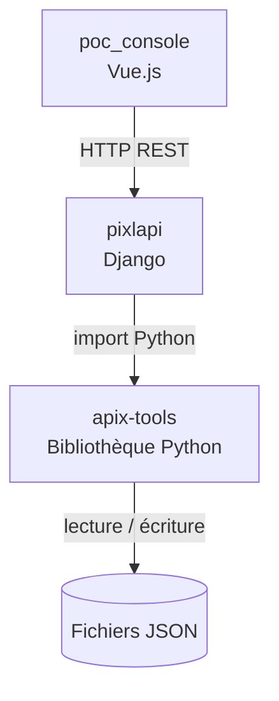

  

La communication entre poc_console et pixlapi se fait en JSON via HTTP. La communication entre pixlapi et apix-tools est un simple import Python — apix-tools n'est pas un service séparé, c'est une bibliothèque directement utilisée dans le code de pixlapi.

  

---

  

## 2. apix-tools — Modélisation des paramètres

  

### Principe général

  

apix-tools fournit des classes Python qui correspondent directement à la structure des fichiers JSON de configuration. La classe de base `ModelMother` implémente la sérialisation automatique : n'importe quel objet qui en hérite peut être converti en dictionnaire JSON et inversement, sans code manuel.

  

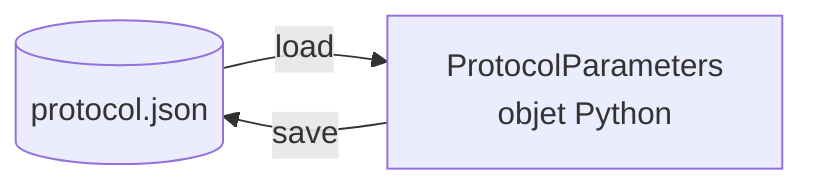

  

Concrètement, quand `load()` est appelé, `ModelMother` lit le JSON et remplit automatiquement les attributs de l'objet. Quand `save()` est appelé, il fait l'inverse : il lit tous les attributs de l'objet et les écrit dans le JSON.

  

### Hiérarchie des classes

  

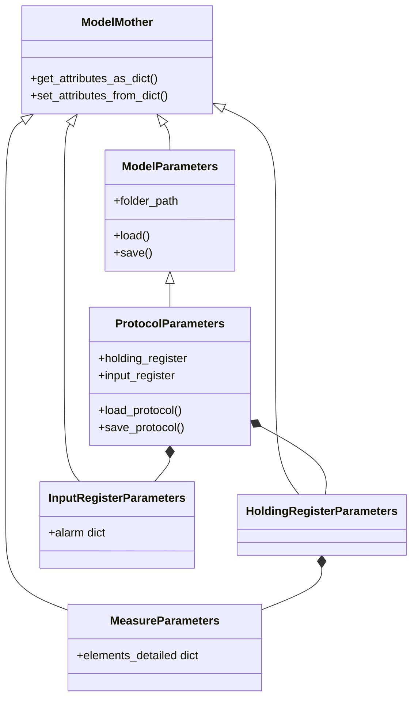

  

`ModelParameters` ajoute la gestion du chemin de fichier et les méthodes `load()` / `save()`. `ProtocolParameters` hérite de `ModelParameters` et possède deux attributs principaux : `holding_register` pour les mesures détaillées, et `input_register` pour les alarmes et l'état du système.

  

### Structure du protocol.json

  

Le fichier `protocol.json` est organisé en deux registres principaux. Le **holding register** contient les mesures détaillées par élément chimique. L'**input register** contient les alarmes, les mesures live, les informations système et les résultats de commandes.

  

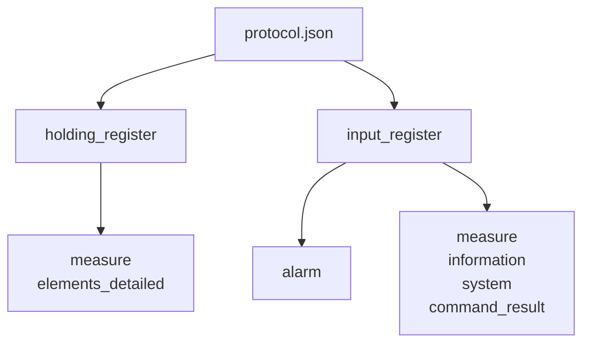

  

Chaque entrée dans ces sections a la même forme : une adresse Modbus, un format de données, et une taille en mots.

  

---

  

## 3. pixlapi — Exposition via REST API

  

### Les endpoints disponibles

  

pixlapi expose plusieurs endpoints dans `metro_api/settings/modbus/`. Chacun correspond à une classe d'apix-tools et à un fichier JSON.

  

| Endpoint | Classe apix-tools | Fichier JSON |

|----------|-------------------|--------------|

| `/settings/modbus/protocol` | `ProtocolParameters` | `protocol.json` |

| `/settings/modbus/network` | `NetworkParameters` | `network.json` |

| `/settings/modbus/register_map` | *(fichier brut)* | `register_map.json` |

| `/settings/enums/<nom>` | `apix_enum.*` | *(pas de JSON)* |

  

### Pattern commun des API settings

  

Tous les endpoints settings suivent exactement le même pattern. À l'initialisation de la vue Django, un objet apix-tools est créé et le fichier JSON est chargé. Le GET retourne les données sérialisées. Le POST met à jour l'objet puis sauvegarde.

  

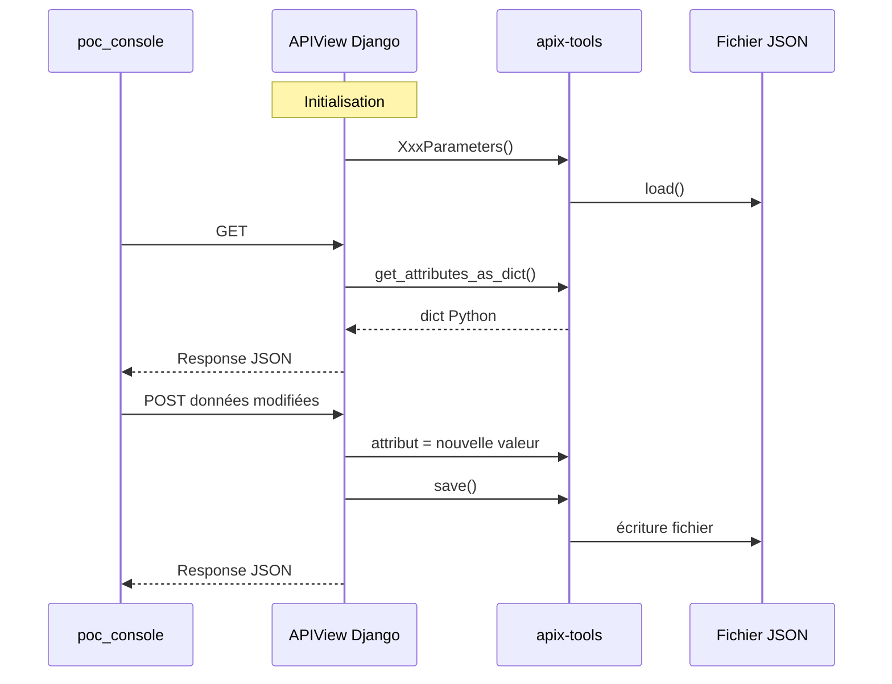

  

### Gestion de l'alarm dans protocol_api.py

  

Le POST de `protocol_api` inspecte les clés présentes dans la requête et met à jour uniquement les sections concernées. Pour les alarmes, il suffit d'assigner le dictionnaire reçu directement à `input_register.alarm`, car cet attribut est un `dict` Python simple géré automatiquement par `ModelMother`.

  

```python

if "input_register" in request.data:

    if "alarm" in request.data["input_register"]:

        self.protocol.input_register.alarm = request.data["input_register"]["alarm"]

  

self.protocol.save_protocol()

```

  

---

  

## 4. poc_console — Interface utilisateur

  

### Initialisation du composant RegisterMapPart.vue

  

Quand le composant se monte, il effectue trois appels API dans l'ordre. D'abord il interroge le protocole pour récupérer les données de référence (éléments disponibles et alarmes disponibles). Ensuite il charge les entrées déjà configurées dans la register map.

  

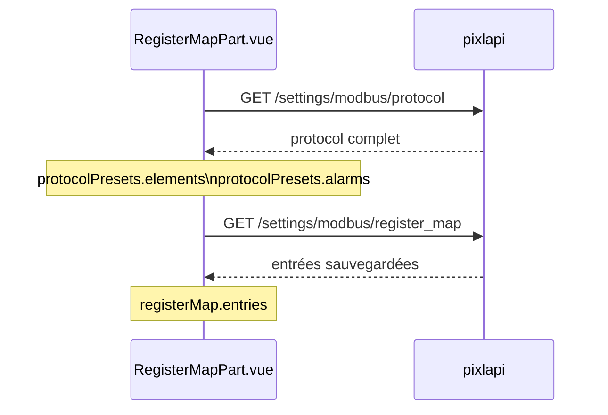

  

Les données du protocole servent de **référence en lecture seule** : elles peuplent les dropdowns et les modales de presets. Les entrées de la register map représentent la **sélection active** de l'utilisateur.

  

### État réactif

  

Le composant maintient plusieurs objets réactifs. `protocolPresets` contient les données issues du protocole — il n'est jamais modifié par l'utilisateur. `registerMap.entries` est la liste des entrées configurées, qui peut être éditée et sauvegardée. `editFormData` est l'état temporaire du formulaire d'ajout/édition.

  

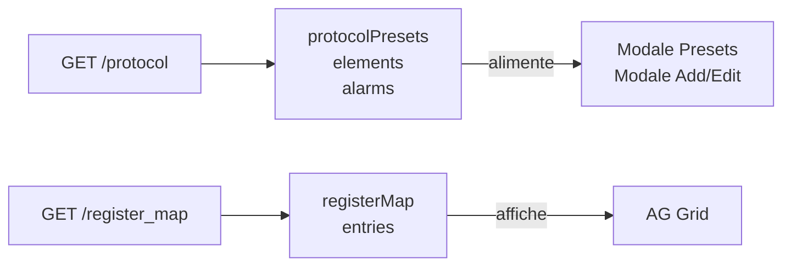

  

### Logique du formulaire Add/Edit

  

Le formulaire s'adapte dynamiquement selon le **Register** choisi. Si l'utilisateur sélectionne IR avec la sous-section `alarm`, le champ "Property Type" disparaît et est remplacé par un dropdown qui liste les alarmes disponibles issues de `protocolPresets.alarms`. Pour les autres sous-sections, le champ "Element Name" et "Property Type" s'affichent normalement.

  

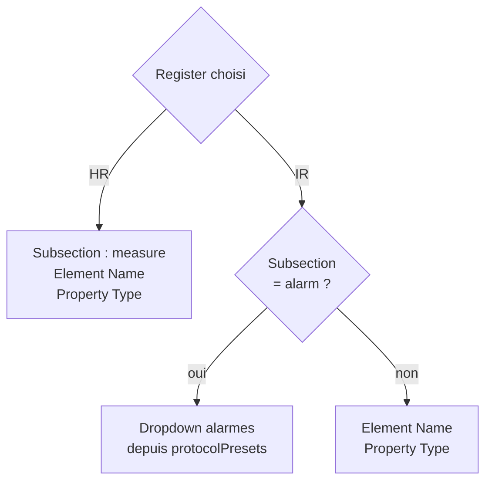

  

Lors de la sauvegarde, le nom de l'entrée est construit différemment selon le type : pour une alarme c'est juste le nom de l'alarme (`alarm_h2s_error`), pour une mesure c'est `element.propriété` (`HHV-C2H6.raw_value`). Le champ `source.section` est automatiquement dérivé de la sous-section choisie.

  

---

  

## 5. Flux GET — Lecture d'un paramètre

  

Voici le détail de ce qui se passe quand poc_console demande les données du protocole au démarrage.

  

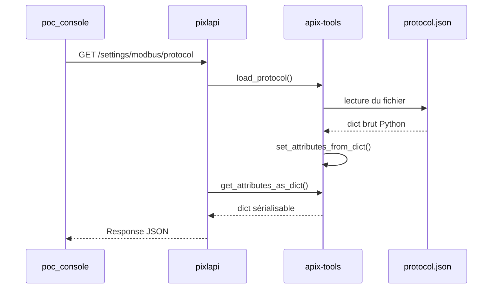

  

`set_attributes_from_dict()` et `get_attributes_as_dict()` sont les deux méthodes clés de `ModelMother`. La première convertit un dict Python en attributs d'objet. La seconde fait l'inverse. Elles gèrent récursivement tous les sous-objets de la hiérarchie.

  

---

  

## 6. Flux POST — Modification d'un paramètre

  

Voici le détail de ce qui se passe quand l'utilisateur sauvegarde une modification dans poc_console.

  

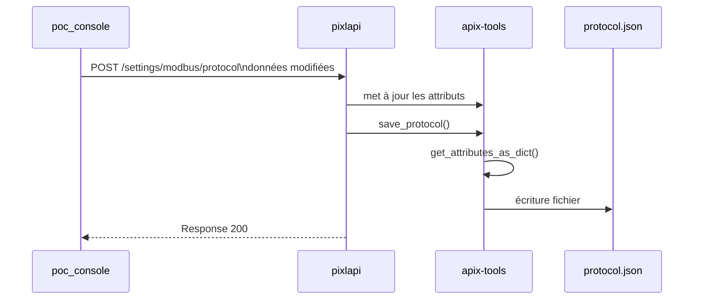

  

La modification ne touche que les attributs explicitement passés dans le POST. Le reste du protocole est préservé car l'objet `ProtocolParameters` avait été chargé intégralement au démarrage.

  

---

  

## 7. Cas pratique — Les alarmes Modbus

  

### Problème initial dans apix-tools

  

La classe `AlarmParameters` modélisait une **seule** entrée d'alarme avec des attributs fixes. Or dans le JSON, `input_register.alarm` est un **dictionnaire de ~300 entrées** avec des clés dynamiques. `ModelMother` ne pouvait pas faire correspondre `alarm_h2s_error` à un attribut fixe de la classe — les données n'étaient jamais chargées.

  

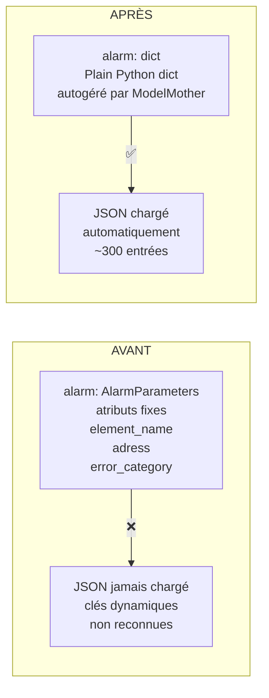

  

La correction consistait à remplacer `self.alarm: AlarmParameters` par `self.alarm: dict = {}` dans `InputRegisterParameters`. `ModelMother` traite les attributs de type `dict` en les copiant directement depuis/vers le JSON, ce qui correspond exactement à la structure plate des alarmes.

  

En parallèle, `AlarmParameters` a été renommée `AlarmEntryParameters` pour servir de classe de référence documentant les champs d'une entrée (`address`, `error_category`, `error_code`, `format`, `size`), en corrigeant la faute de frappe `adress` → `address` et en ajoutant le champ `error_code` absent.

  

### Chaîne complète de bout en bout

  

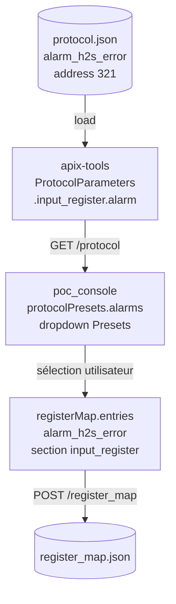

  

L'utilisateur voit la liste des alarmes disponibles (issues du protocole), en sélectionne une, et cette sélection est sauvegardée dans `register_map.json`. Le protocole lui-même n'est pas modifié — il reste la source de vérité des adresses et formats.