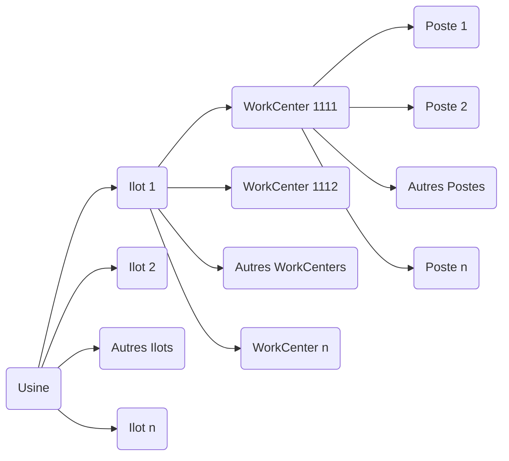

# Rapport de stage

## L'entreprise Raynet

### Présentation

L'entreprise Raynet a été créée en 2000 et vise à supporter le réseau ARaymond Information System. Elle contribue aux activités des compagnies en fournissant une expertise technique dans de nombreuses zones comme le support IT, l'infrastructure IT ou la gestion des systèmes d'information.
Le siège social se situe au **113 cours Berriat, 38000 Grenoble, France**. C'est une société par actions simplifiées (SAS) avec un capital social de **25 000 euros**.

Raynet se concentre essentiellement sur :

* Le développement de systèmes d'information.
* La fourniture de solutions IT innovantes, centrées sur la création de valeur pour ses clients.
* La gestion d'installations informatiques.

En parallèle, Raynet joue un rôle clé dans la fabrication et la simulation de pièces industrielles via son logiciel **Raypro**, utilisé principalement dans le domaine automobile pour concevoir, simuler et optimiser les processus de production.

---

### Chiffres clés

* **Effectif** : 250 personnes dans le monde.
* **Chiffre d'affaires** : 54 millions d'euros en 2023 (+8,52 % par rapport à 2022).
* **Exportation** : Une part importante du chiffre d'affaires provient des marchés internationaux, représentant environ 80 % des revenus.

---

### Une présence mondiale

Bien que le siège social soit à Grenoble, Raynet possède des bureaux et installations dans plusieurs pays :

#### **Europe**

* **France** : Siège social à Grenoble.
* **Allemagne** : Paderborn (siège principal), Regensburg, Ingolstadt, Berlin.
* **Italie**, **Espagne**, **Pologne**, **Royaume-Uni**, **Turquie**.

#### **Amérique du Nord**

* **États-Unis** : Schaumburg, Illinois.

#### **Asie**

* **Japon** : Tokyo.

#### **Afrique du Nord**

* **Maroc** : Casablanca.

Raynet fait partie du réseau ARaymond, présent dans **21 pays sur 4 continents** avec plus de **35 filiales**, ce qui lui permet de bénéficier d'une forte implantation internationale pour répondre aux besoins variés de ses clients.

---

### Logiciel phare : Raypro

Raynet développe et utilise le logiciel **Raypro**, conçu pour la construction et la simulation de pièces industrielles. Ce logiciel est particulièrement utilisé dans :

* Le domaine automobile pour concevoir des pièces complexes.
* Simuler leur comportement avant fabrication.
* Optimiser les processus de production.

Raypro joue un rôle essentiel dans l'intégration des étapes de conception, prototypage et fabrication dans un flux de travail rationalisé.

---

## Méthodes de travail et outils

### Versionnage

Nous travaillons sur trois versions distinctes du logiciel, chacune ayant un rôle spécifique dans le cycle de développement :

* **Version de production** : La version la plus stable et éprouvée. Elle est utilisée en environnement réel.
* **Version de test** : Une version intermédiaire, plus récente que la version de production, utilisée pour les tests approfondis.
* **Version de développement** : La version la plus récente, où les nouvelles fonctionnalités et correctifs sont en cours de développement.

### Cycle de mise à jour des versions

Lorsque la version de test est validée et passe en production, les versions évoluent comme suit :

1. La **version de production** prend la place de la version de test.
2. La **version de test** prend la place de la version de développement.
3. Une nouvelle **version de développement** est créée avec un incrément.

```
## Versions initiales :

* Version de production : 2.65  
* Version de test : 2.66  
* Version de développement : 2.67

## Après mise à jour :

* Nouvelle version de production : 2.66 (ancienne version de test)  
* Nouvelle version de test : 2.67 (ancienne version de développement)  
* Nouvelle version de développement : 2.68 (incrémentée).
```

### Organisation physique de l'usine



Cette structure reflète une organisation typique :

* **Usine (Plant)** : Le site global.
* **Ilots (Ilots)** : Regroupements d'équipements ou d'activités similaires
* **WorkCenters** : Zones spécifiques dans un ilot où des processus précis sont effectués.
* **Postes (Workstations)** : Les unités les plus détaillées où les tâches sont réalisées

---

## Fonctionnement des logiciels

Trois logiciels principaux sont utilisés pour gérer et simuler les processus industriels :

| Logiciel               | Fonction principale                                                    | Utilisation en atelier |
| ---------------------- | ---------------------------------------------------------------------- | ---------------------- |
| **Raypro Supervision** | Modélisation et optimisation des chaînes de production complètes       | Oui                    |
| **Raypro Simulator**   | Simulation virtuelle des machines pour le développement et les tests   | Non                    |
| **Raypro Machine**     | Suivi en temps réel des performances et du fonctionnement des machines | Oui                    |

### Détails des logiciels

#### **Raypro Supervision**

Ce logiciel est conçu pour paramétrer et modéliser une chaîne complète de production. Ses principales fonctionnalités incluent :

* Identification des goulets d'étranglement et des inefficacités.
* Optimisation des flux grâce à une modélisation précise des processus, ressources et objets impliqués.

#### **Raypro Simulator**

Raypro Simulator permet la simulation virtuelle d'une machine physique, utile pour le développement et les tests sans nécessiter l'accès à une machine réelle. Ses avantages :

* Création d'un modèle virtuel précis d'une machine.
* Test des programmes et configurations avant leur mise en œuvre réelle.
* Réduction des coûts liés aux tests physiques.

#### **Raypro Machine**

Ce logiciel est utilisé directement sur les machines pour surveiller leur fonctionnement pendant la production. Il offre :

* Un suivi en temps réel des états des machines.
* Une détection rapide des problèmes ou dysfonctionnements.
* Un suivi précis des performances et délais pour chaque étape.

---

## Outils et techniques de test automatisé

### Présentation de TestComplete

Dans le cadre de mon stage, j’ai été formé à l’utilisation de **TestComplete**, un outil développé par **SmartBear**, qui permet d’automatiser des tests fonctionnels sur des applications bureautiques (desktop), web ou mobiles. Il est particulièrement adapté aux environnements de développement continu où la régression fonctionnelle doit être vérifiée rapidement à chaque mise à jour.

TestComplete offre deux modes de création de tests :

* **Par script**, dans différents langages (JavaScript, Python, VBScript, etc.).
* **Par Keyword Tests**, qui permettent de créer des tests sous forme de blocs d’actions visuels, plus accessibles et lisibles.

---

### Le système de NameMapping

Avant de créer des tests automatisés, il est essentiel de configurer correctement le **NameMapping**, un système qui permet à TestComplete d’**identifier les objets de l’interface**. Chaque objet (champ, bouton, fenêtre...) est décrit par un ensemble de propriétés (comme `Name`, `ClassName`, `ID`, etc.) qui permettent à TestComplete de le retrouver de manière stable, même si sa position ou sa structure change dans l'application.

Une attention particulière a été portée à cette phase, car un NameMapping généré uniquement par l’enregistrement automatique est souvent peu fiable : il peut contenir des références dynamiques ou non significatives (comme des index ou des chemins instables). J’ai donc appris à :

* Identifier les objets avec l’inspecteur d’objet.
* Nettoyer le mapping automatique.
* Modifier les critères pour obtenir une hiérarchie logique et durable.

---

### Création de tests avec les Keyword Tests et le mode Record

Une fois le NameMapping en place, j’ai utilisé la fonction **Record** de TestComplete pour créer mes tests en mode **Keyword Test**. Cette méthode consiste à capturer les actions utilisateur (clics, saisies, etc.) et à les transformer automatiquement en blocs d’actions organisés. Ce système est particulièrement efficace pour construire rapidement des tests de validation.

Ces Keyword Tests peuvent ensuite être enrichis avec des vérifications, des conditions, des boucles ou des appels à d’autres tests, afin de modéliser des scénarios plus complexes.

---

### Utilisation ponctuelle de VBScript

Dans certains cas, malgré un NameMapping précis, TestComplete n’arrivait pas à reconnaître certains objets à l’aide des méthodes classiques. J’ai alors eu recours, de manière **ponctuelle**, à du **code VBScript**, principalement pour :

* Identifier dynamiquement des objets non mappés


.

* Parcourir la hiérarchie des objets avec des fonctions comme `FindChild`.
* Ajouter des vérifications ou des interactions plus fines.

Ces scripts simples m’ont permis de dépasser les limites du mode visuel tout en découvrant les bases de l’automatisation avancée.

---

## Le travail demandé

Au début de mon stage, je n’ai pas directement commencé le développement des tests. En effet, une phase de formation préalable était nécessaire pour bien comprendre le contexte et les outils utilisés. J’ai d’abord été formé sur le logiciel **Raypro Supervision**, afin d’en maîtriser le fonctionnement et ses spécificités. Cette étape m’a permis d’acquérir les connaissances nécessaires de l’application sur laquelle je devais travailler, ce qui est essentiel pour concevoir des tests pertinents et efficaces.

Parallèlement, M. Benjamen Radoux m’a présenté l’outil **TestComplete**, qui est utilisé pour automatiser les tests. Il m’a notamment montré comment utiliser la fonction d’enregistrement, une méthode intuitive qui facilite la création de scripts de test en capturant les interactions avec l’application. Cette démonstration m’a aidé à comprendre les possibilités et les limites de l’outil.

Durant cette phase, j’ai également bénéficié d’un accompagnement précieux de la part de mes collègues Manu et Martine Maume, qui développent régulièrement des tests pour Raypro Supervision. Leur expérience m’a permis de progresser rapidement : chaque fois que je rencontrais une difficulté ou avais une question spécifique, ils étaient disponibles pour m’apporter des conseils et des solutions. Ce soutien a été un facteur clé dans la réussite de mes premières réalisations.

Afin de mieux comprendre l’entreprise et son environnement, j’ai eu l’opportunité de visiter le **musée ARhome**, situé à Grenoble, dès le troisième jour de mon stage. Ce musée privé retrace l’histoire de l’entreprise ARaymond, fondée il y a plus de 140 ans par Albert-Pierre ARaymond, inventeur du bouton-pression. Le parcours muséal, à la fois historique et sensoriel, présente l’évolution d’une entreprise familiale devenue un leader international dans le domaine de la fixation, notamment pour l’industrie automobile.

La visite m’a permis de découvrir les innovations industrielles majeures, les collections liées à la ganterie grenobloise, ainsi que les nombreuses machines et brevets qui illustrent la capacité d’innovation constante d’ARaymond. Comprendre ce contexte historique et industriel m’a donné une vision plus large de l’importance de mon travail dans le cadre des activités de l’entreprise, ainsi que l’esprit d’innovation qui la caractérise.

Une fois cette phase de formation et d’immersion terminée, j’ai commencé à développer des tests automatisés en utilisant la méthode d’enregistrement dans TestComplete, en m’appuyant sur différents scripts de tests qui m’ont été fournis. Cette première expérience pratique m’a permis de mettre en application les connaissances acquises et de mieux comprendre l’utilisation de l’outil TestComplete.

Ils m’ont également laissé explorer librement le logiciel, ce qui m’a donné l’opportunité de « bidouiller » et d’expérimenter par moi-même afin de mieux appréhender ses fonctionnalités. Pour éviter toute interférence avec la branche principale des tests, une **nouvelle suite de projet** a été créée spécialement pour moi dans TestComplete. Cette organisation m’a permis de travailler en toute autonomie tout en garantissant la stabilité des tests déjà en place.

Cette phase d’expérimentation m’a ainsi permis d’appréhender concrètement les enjeux liés à l’automatisation des tests fonctionnels, tout en contribuant à l’amélioration continue de la qualité de l’application Raypro Supervision.
