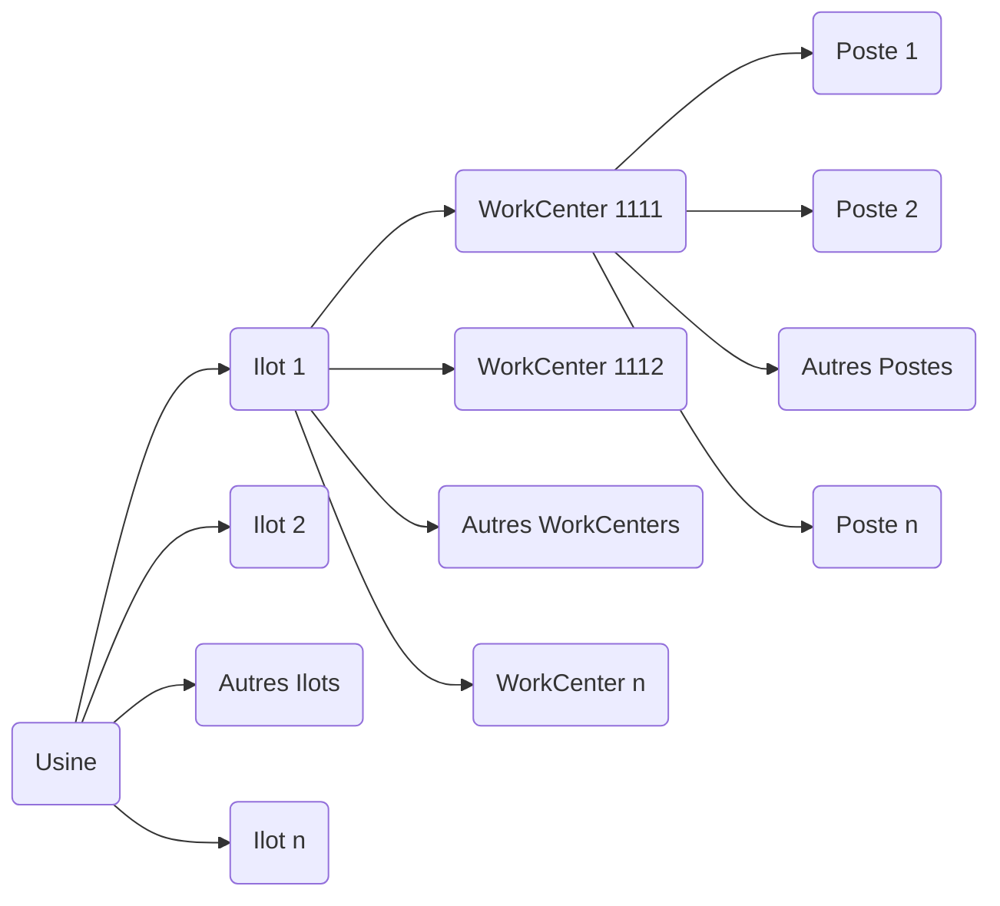

# Rapport de stage

## L'entreprise Raynet

### Présentation

L'entreprise Raynet a été créée en 2000 et vise à supporter le réseau ARaymond Information System. Elle contribue aux activités des compagnies en fournissant une expertise technique dans de nombreuses zones comme le support IT, l'infrastructure IT ou la gestion des systèmes d'information.
Le siège social se situe au **113 cours Berriat, 38000 Grenoble, France**. C'est une société par actions simplifiées (SAS) avec un capital social de **25 000 euros**.

Raynet se concentre essentiellement sur :

* Le développement de systèmes d'information.
* La fourniture de solutions IT innovantes, centrées sur la création de valeur pour ses clients.
* La gestion d'installations informatiques.

En parallèle, Raynet joue un rôle clé dans la fabrication et la simulation de pièces industrielles via son logiciel **Raypro**, utilisé principalement dans le domaine automobile pour concevoir, simuler et optimiser les processus de production.

---

### Chiffres clés

* **Effectif** : 250 personnes dans le monde.
* **Chiffre d'affaires** : 54 millions d'euros en 2023 (+8,52 % par rapport à 2022).
* **Exportation** : Une part importante du chiffre d'affaires provient des marchés internationaux, représentant environ 80 % des revenus.

---

### Une présence mondiale

Bien que le siège social soit à Grenoble, Raynet possède des bureaux et installations dans plusieurs pays :

#### **Europe**

* **France** : Siège social à Grenoble.
* **Allemagne** : Paderborn (siège principal), Regensburg, Ingolstadt, Berlin.
* **Italie**, **Espagne**, **Pologne**, **Royaume-Uni**, **Turquie**.

#### **Amérique du Nord**

* **États-Unis** : Schaumburg, Illinois.

#### **Asie**

* **Japon** : Tokyo.

#### **Afrique du Nord**

* **Maroc** : Casablanca.

Raynet fait partie du réseau ARaymond, présent dans **21 pays sur 4 continents** avec plus de **35 filiales**, ce qui lui permet de bénéficier d'une forte implantation internationale pour répondre aux besoins variés de ses clients.

---

### Logiciel phare : Raypro

Raynet développe et utilise le logiciel **Raypro**, conçu pour la construction et la simulation de pièces industrielles. Ce logiciel est particulièrement utilisé dans :

* Le domaine automobile pour concevoir des pièces complexes.
* Simuler leur comportement avant fabrication.
* Optimiser les processus de production.

Raypro joue un rôle essentiel dans l'intégration des étapes de conception, prototypage et fabrication dans un flux de travail rationalisé.

---

## Méthodes de travail et outils

### Versionnage

Nous travaillons sur trois versions distinctes du logiciel, chacune ayant un rôle spécifique dans le cycle de développement :

* **Version de production** : La version la plus stable et éprouvée. Elle est utilisée en environnement réel.
* **Version de test** : Une version intermédiaire, plus récente que la version de production, utilisée pour les tests approfondis.
* **Version de développement** : La version la plus récente, où les nouvelles fonctionnalités et correctifs sont en cours de développement.

### Cycle de mise à jour des versions

Lorsque la version de test est validée et passe en production, les versions évoluent comme suit :

1. La **version de production** prend la place de la version de test.
2. La **version de test** prend la place de la version de développement.
3. Une nouvelle **version de développement** est créée avec un incrément.

```
## Versions initiales :

* Version de production : 2.65  
* Version de test : 2.66  
* Version de développement : 2.67

## Après mise à jour :

* Nouvelle version de production : 2.66 (ancienne version de test)  
* Nouvelle version de test : 2.67 (ancienne version de développement)  
* Nouvelle version de développement : 2.68 (incrémentée).
```

### Organisation physique de l'usine



Cette structure reflète une organisation typique :

* **Usine (Plant)** : Le site global.
* **Ilots (Ilots)** : Regroupements d'équipements ou d'activités similaires
* **WorkCenters** : Zones spécifiques dans un ilot où des processus précis sont effectués.
* **Postes (Workstations)** : Les unités les plus détaillées où les tâches sont réalisées

---

## Fonctionnement des logiciels

Trois logiciels principaux sont utilisés pour gérer et simuler les processus industriels :

| Logiciel               | Fonction principale                                                    | Utilisation en atelier |
| ---------------------- | ---------------------------------------------------------------------- | ---------------------- |
| **Raypro Supervision** | Modélisation et optimisation des chaînes de production complètes       | Oui                    |
| **Raypro Simulator**   | Simulation virtuelle des machines pour le développement et les tests   | Non                    |
| **Raypro Machine**     | Suivi en temps réel des performances et du fonctionnement des machines | Oui                    |

### Détails des logiciels

#### **Raypro Supervision**

Ce logiciel est conçu pour paramétrer et modéliser une chaîne complète de production. Ses principales fonctionnalités incluent :

* Identification des goulets d'étranglement et des inefficacités.
* Optimisation des flux grâce à une modélisation précise des processus, ressources et objets impliqués.

#### **Raypro Simulator**

Raypro Simulator permet la simulation virtuelle d'une machine physique, utile pour le développement et les tests sans nécessiter l'accès à une machine réelle. Ses avantages :

* Création d'un modèle virtuel précis d'une machine.
* Test des programmes et configurations avant leur mise en œuvre réelle.
* Réduction des coûts liés aux tests physiques.

#### **Raypro Machine**

Ce logiciel est utilisé directement sur les machines pour surveiller leur fonctionnement pendant la production. Il offre :

* Un suivi en temps réel des états des machines.
* Une détection rapide des problèmes ou dysfonctionnements.
* Un suivi précis des performances et délais pour chaque étape.

---

## Outils et techniques de test automatisé

### Présentation de TestComplete

Dans le cadre de mon stage, j’ai été formé à l’utilisation de **TestComplete**, un outil développé par **SmartBear**, qui permet d’automatiser des tests fonctionnels sur des applications bureautiques (desktop), web ou mobiles. Il est particulièrement adapté aux environnements de développement continu où la régression fonctionnelle doit être vérifiée rapidement à chaque mise à jour.

TestComplete offre deux modes de création de tests :

* **Par script**, dans différents langages (JavaScript, Python, VBScript, etc.).
* **Par Keyword Tests**, qui permettent de créer des tests sous forme de blocs d’actions visuels, plus accessibles et lisibles.

---

### Le système de NameMapping

Avant de créer des tests automatisés, il est essentiel de configurer correctement le **NameMapping**, un système qui permet à TestComplete d’**identifier les objets de l’interface**. Chaque objet (champ, bouton, fenêtre...) est décrit par un ensemble de propriétés (comme `Name`, `ClassName`, `ID`, etc.) qui permettent à TestComplete de le retrouver de manière stable, même si sa position ou sa structure change dans l'application.

Une attention particulière a été portée à cette phase, car un NameMapping généré uniquement par l’enregistrement automatique est souvent peu fiable : il peut contenir des références dynamiques ou non significatives (comme des index ou des chemins instables). J’ai donc appris à :

* Identifier les objets avec l’inspecteur d’objet.
* Nettoyer le mapping automatique.
* Modifier les critères pour obtenir une hiérarchie logique et durable.

---

### Création de tests avec les Keyword Tests et le mode Record

Une fois le NameMapping en place, j’ai utilisé la fonction **Record** de TestComplete pour créer mes tests en mode **Keyword Test**. Cette méthode consiste à capturer les actions utilisateur (clics, saisies, etc.) et à les transformer automatiquement en blocs d’actions organisés. Ce système est particulièrement efficace pour construire rapidement des tests de validation.

Ces Keyword Tests peuvent ensuite être enrichis avec des vérifications, des conditions, des boucles ou des appels à d’autres tests, afin de modéliser des scénarios plus complexes.

---

### Utilisation ponctuelle de VBScript

Dans certains cas, malgré un NameMapping précis, TestComplete n’arrivait pas à reconnaître certains objets à l’aide des méthodes classiques. J’ai alors eu recours, de manière **ponctuelle**, à du **code VBScript**, principalement pour :

* Identifier dynamiquement des objets non mappés


.

* Parcourir la hiérarchie des objets avec des fonctions comme `FindChild`.
* Ajouter des vérifications ou des interactions plus fines.

Ces scripts simples m’ont permis de dépasser les limites du mode visuel tout en découvrant les bases de l’automatisation avancée.

---

## 1. Phase de découverte et immersion
Au début de mon stage, je n’ai pas immédiatement commencé à développer des tests. Une phase de formation préalable était nécessaire afin de bien comprendre le contexte fonctionnel de l’entreprise et les outils techniques utilisés.

### Découverte de Raypro Supervision
J’ai d’abord été formé sur le logiciel Raypro Supervision, qui constitue le cœur de l’application à tester. Cette formation m’a permis de maîtriser les fonctionnalités principales de l’outil, son organisation, et les processus industriels qu’il modélise. Cela a été une étape essentielle pour acquérir les connaissances nécessaires à la conception de tests pertinents et adaptés aux cas métiers.

### Introduction à TestComplete
En parallèle, j’ai été introduit à TestComplete, l’outil d’automatisation utilisé au sein de l’équipe. M. Benjamen Radoux m’a présenté les fonctionnalités principales du logiciel, notamment le mode d’enregistrement (record), qui permet de capturer les interactions avec l’interface pour générer automatiquement des tests, sous forme de Keyword Tests. Cette approche m’a semblé intuitive et rapide à prendre en main, bien qu’elle présente certaines limites en termes de personnalisation et de robustesse.

### Accompagnement de l’équipe
Durant cette période d’apprentissage, j’ai bénéficié de l’accompagnement précieux de Manu et Martine Maume, collègues expérimentés dans le développement de tests automatisés pour Raypro Supervision. Ils ont su répondre à mes nombreuses questions techniques, m’aider à surmonter les blocages que je rencontrais, et m’orienter dans mes premiers essais. Leur soutien a grandement facilité ma montée en compétence.

### Visite du musée ARhome
Dans une optique d’immersion dans l’environnement de l’entreprise, j’ai eu l’opportunité de visiter, dès le troisième jour de mon stage, le musée ARhome situé à Grenoble. Ce musée retrace l’histoire du groupe ARaymond, fondé il y a plus de 140 ans par Albert-Pierre ARaymond, inventeur du bouton-pression. Le parcours muséal, à la fois historique, technique et sensoriel, m’a permis de découvrir :

- Les innovations majeures de l’entreprise dans le domaine de la fixation industrielle ;

- Des objets liés à la ganterie grenobloise ;

- Des machines anciennes, brevets historiques et pièces emblématiques.

Cette visite m’a offert une vision plus large du rôle de l’entreprise dans l’histoire industrielle locale et mondiale, et m’a aidé à mieux comprendre la portée de mon travail dans un contexte plus global d’innovation continue.

###Premiers essais pratiques
À l’issue de cette phase de formation, j’ai pu débuter mes premiers tests automatisés en utilisant la méthode d’enregistrement dans TestComplete. Je me suis appuyé sur des scripts de test déjà existants pour apprendre les bonnes pratiques et comprendre la structure des projets.

En parallèle, j’ai été encouragé à explorer librement le logiciel, ce qui m’a permis de "bidouiller", tester différentes approches et expérimenter les fonctionnalités de TestComplete de manière autonome.

Pour ne pas interférer avec les projets existants, une nouvelle suite de projet isolée m’a été dédiée. Cela m’a offert un espace de travail sécurisé, où je pouvais expérimenter sans impacter la branche principale des tests de production.


## 2. Refonte du NameMapping et amélioration de la documentation
Identification du problème du NameMapping
Au début de mon travail sur les tests automatisés, j’ai constaté que le NameMapping existant dans TestComplete n’était pas optimal. Il avait été principalement généré à l’aide de la fonctionnalité d'enregistrement, ce qui a conduit à une structure désorganisée et des objets mal identifiés. En effet, cette méthode d’enregistrement automatique avait entraîné une gestion difficile des objets, avec des noms peu explicites, des attributs non stables et des objets inutiles ou redondants.

### Proposition et refonte du NameMapping
Après avoir compris les enjeux de cette structure, j’ai proposé de **refaire complètement le NameMapping**. Ce n'était pas une tâche initialement demandée, mais j’ai jugé que cette refonte était essentielle pour garantir la stabilité et la fiabilité des tests automatisés à long terme.

Mon travail a consisté à :

- Nettoyer le NameMapping existant : suppression des objets obsolètes, des doublons et des éléments inutiles.

- Améliorer la structure : j’ai réorganisé les objets selon des critères logiques (par fenêtres, modules, et composants) pour mieux refléter l’architecture de l’application.

- Améliorer les identifiants : j’ai redéfini des noms explicites et utilisé des attributs stables (identifiants uniques, propriétés fixes) pour garantir que les objets seraient correctement identifiables.

- Optimiser la hiérarchie : j’ai simplifié l’arborescence des objets pour qu’elle soit plus lisible et plus facile à maintenir.

### Documentation et bonnes pratiques
En parallèle de la refonte, j’ai également contribué à la documentation interne du projet. J’ai rédigé des sections expliquant le fonctionnement du NameMapping et détaillant les bonnes pratiques à suivre pour la création de nouveaux objets. Voici quelques points abordés dans cette documentation :

- Comment identifier un objet de manière fiable (en utilisant les attributs stables et les hiérarchies appropriées).

- La gestion des objets redondants et des pratiques pour éviter la duplication.

- Des exemples pratiques pour illustrer les meilleures façons de structurer le NameMapping.

- Ce travail de documentation a permis de rendre plus accessible et maintenable le processus de gestion des objets dans TestComplete.

## 3. Réalisation des tests automatisés
### Création des tests automatisés avec TestComplete
Une fois la refonte du NameMapping terminée, j’ai pu commencer à développer les tests automatisés qui m’étaient attribués. Ces tests avaient pour objectif de valider les fonctionnalités de l’application Raypro Supervision et de vérifier qu’elles se comportaient correctement dans différents scénarios.

- Keyword Tests avec enregistrement : j’ai utilisé principalement la méthode d’enregistrement pour créer des tests fonctionnels. Cette approche permet de capturer les interactions utilisateur avec l’interface et de les convertir en étapes de test. C’est un moyen rapide et efficace de créer des tests de validation basiques.

- Pour chaque test, j’ai inclus des assertions afin de vérifier que les résultats correspondaient aux attentes définies par les spécifications. J’ai également mis en place des vérifications d’état pour confirmer que l’interface utilisateur répondait correctement après chaque action (clic, saisie, etc.).

- Ajout de conditions et de répétitions : pour des scénarios plus complexes, j’ai utilisé des conditions logiques (if/else) et des boucles répétitives afin de tester plusieurs cas avec un seul script. Cela m’a permis de rendre les tests plus dynamiques et de couvrir une plus large gamme de situations.

### Utilisation du VBScript
Dans certains cas, j’ai rencontré des objets ou des éléments d’interface qui n’étaient pas correctement identifiables via le NameMapping standard. J’ai donc utilisé VBScript de manière ponctuelle pour contourner cette limitation et accéder à ces objets.

Par exemple, j’ai écrit de petits scripts pour :

- Accéder à des objets dynamiques dont les identifiants étaient difficiles à capturer automatiquement.

- Manipuler des éléments interactifs qui n’étaient pas bien gérés par les objets de base du NameMapping.

Cette approche m’a permis de compléter mes tests en traitant des cas où le NameMapping seul ne suffisait pas à assurer une reconnaissance correcte des objets.

### Bilan des tests réalisés
J’ai ainsi contribué à l’automatisation de tests fonctionnels pour l’application Raypro Supervision, en mettant l’accent sur la robustesse des scripts, leur réutilisabilité et leur maintenabilité. Ce travail a permis de gagner en efficacité dans le processus de validation, tout en assurant une couverture plus large des fonctionnalités de l’application.

Conclusion du travail réalisé
Au total, cette organisation en trois grandes étapes (formation, refonte du NameMapping, développement des tests) m’a permis de progresser rapidement tout en apportant une valeur ajoutée à l’équipe. Le fait d’avoir pris l’initiative de refaire le NameMapping, couplé à la réalisation de tests automatisés de qualité, a contribué à améliorer la stabilité et la fiabilité des tests, et à rendre l’ensemble du processus plus maintenable à long terme.


