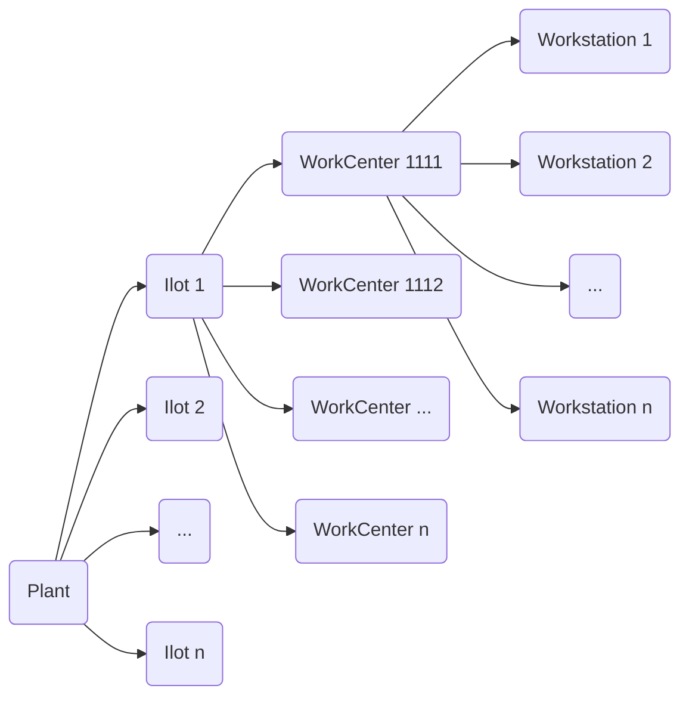

# Versionnage
Nous travaillons sur 3 versions :
- La version de production qui est la version la plus ancienne, celle où on est sûre qu'elle marche
- La version de tests qui est la une version supérieure par rapport à la version de test
- La version de dév qui est un version supérieure par rapport à la version de test

>[!Example]
> - **Version de production** : `2.65`
> - **Version de test** : `2.66`
> - **Version de développement web** : `2.67`

Quand La version de test est totalement testée et qu'on décide de la passer en production, chaque version prend une version supérieure :
- **Version de production** <- Version de test
- **Version de test** <- Version de développement
- **Version de développement** <- `dev_version += 1`
> [!Example]
> En se référant à l'exemple :
> - **Version de production** : `2.66`
> - **Version de test** : `2.67`
> - **Version de développement web** : `2.68`

# Organisation physique de l'usine

![[Exemple d'une Plant.excalidraw]]

# Fonctionnement des logiciels
3 logiciels :
- Raypro supervision (Simuler chaîne de production)
- Raypro machine (simuler une machine)
- Raypro simulator (Simuler la production de quelque chose sur une machine)

## Raypro Supervision

Ce logiciel est conçu pour paramétrer une chaîne de production complète. Il permet de modéliser les processus, les ressources et les objets impliqués dans une usine ou un atelier. Grâce à cette modélisation, les utilisateurs peuvent :

- Identifier les goulets d'étranglement et les inefficacités dans la chaîne de production.
    
- Optimiser les flux de production en se basant sur la modélisation effectuée.
    

## Raypro Simulator

Ce logiciel permet de simuler la production d’un produit ou d’un objet sur une machine donnée. Il combine les capacités de Raynet Machine et Supervision pour modéliser l’ensemble du processus, depuis l’entrée des matières premières jusqu’à la sortie du produit fini. Les avantages incluent :

- La vérification des performances des machines dans un environnement simulé.
    
- L’analyse des interactions entre différentes machines ou étapes de production.
    
- L’amélioration de la qualité et de l’efficacité globale du processus

## Raypro Machine

Raynet Machine simule une machine physique pour les phases de développement et de test. Cela est particulièrement utile lorsque les machines ne sont pas disponibles physiquement dans le bâtiment ou lorsqu'il est coûteux ou impossible de les utiliser directement. Les fonctionnalités incluent :

- La création d'un modèle virtuel précis d'une machine spécifique.
    
- La possibilité de tester des programmes et des configurations sur la machine simulée avant leur mise en œuvre réelle.
    
- Une réduction des coûts liés aux tests physiques grâce à la simulation
    

