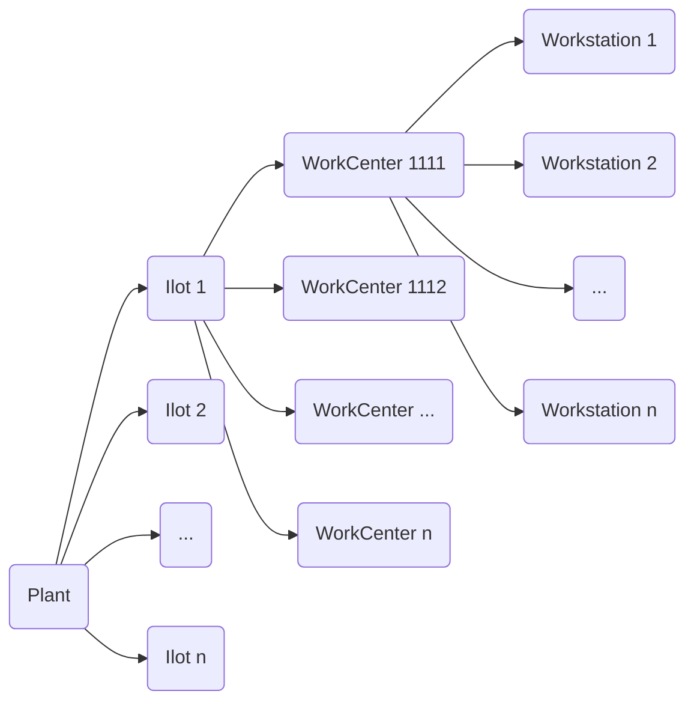

# Versionnage
Nous travaillons sur 3 versions :
- La version de production qui est la version la plus ancienne, celle où on est sûre qu'elle marche
- La version de tests qui est la une version supérieure par rapport à la version de test
- La version de dév qui est un version supérieure par rapport à la version de test

>[!Example]
> - **Version de production** : `2.65`
> - **Version de test** : `2.66`
> - **Version de développement web** : `2.67`

Quand La version de test est totalement testée et qu'on décide de la passer en production, chaque version prend une version supérieure :
- **Version de production** <- Version de test
- **Version de test** <- Version de développement
- **Version de développement** <- `dev_version += 1`
> [!Example]
> En se référant à l'exemple :
> - **Version de production** : `2.66`
> - **Version de test** : `2.67`
> - **Version de développement web** : `2.68`

# Organisation physique de l'usine

![[Exemple d'une Plant.excalidraw]]