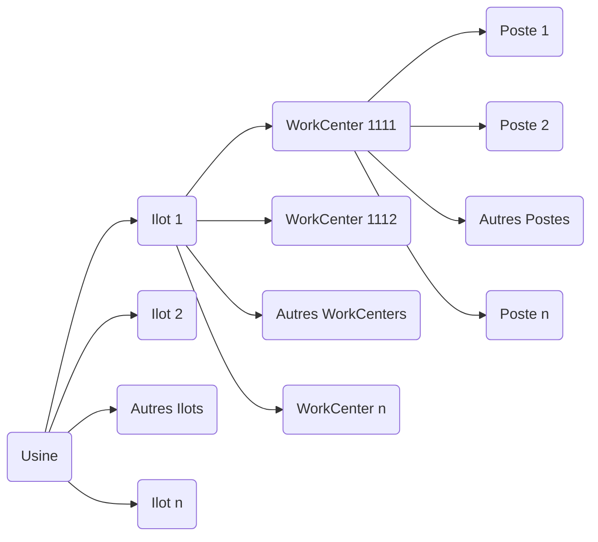

Bien sûr, voici le contenu que j'ai précédemment organisé, mais cette fois intégré dans une grande partie intitulée **"Méthodes de travail et outils"**. Vous pouvez ajouter d'autres parties comme **"Présentation générale de l'entreprise"**, **"Chiffres clés"**, etc., selon vos besoins.

## Méthodes de travail et outils

## Versionnage

Nous travaillons sur trois versions distinctes du logiciel, chacune ayant un rôle spécifique dans le cycle de développement :

- **Version de production** : La version la plus stable et éprouvée. Elle est utilisée en environnement réel.
- **Version de test** : Une version intermédiaire, plus récente que la version de production, utilisée pour les tests approfondis.
- **Version de développement** : La version la plus récente, où les nouvelles fonctionnalités et correctifs sont en cours de développement.

## Cycle de mise à jour des versions

Lorsque la version de test est validée et passe en production, les versions évoluent comme suit :

1. La **version de production** prend la place de la version de test.
2. La **version de test** prend la place de la version de développement.
3. Une nouvelle **version de développement** est créée avec un incrément.

## Exemple

## Versions initiales :

- Version de production : `2.65`
- Version de test : `2.66`
- Version de développement : `2.67`

## Après mise à jour :

- Nouvelle version de production : `2.66` (ancienne version de test)
- Nouvelle version de test : `2.67` (ancienne version de développement)
- Nouvelle version de développement : `2.68` (incrémentée).

## Organisation physique de l'usine

L'organisation physique d'une usine peut être représentée sous forme hiérarchique, allant du niveau global (l'usine) au niveau le plus détaillé (les postes de travail).

Cette structure reflète une organisation typique :
- **Usine (Plant)** : Le site global.
- **Ilots (Ilots)** : Regroupements d'équipements ou d'activités similaires
- **WorkCenters** : Zones spécifiques dans un ilot où des processus précis sont effectués.
- **Postes (Workstations)** : Les unités les plus détaillées où les tâches sont réalisées

## Fonctionnement des logiciels
Trois logiciels principaux sont utilisés pour gérer et simuler les processus industriels :

|Logiciel|Fonction principale|Utilisation en atelier|
|---|---|---|
|**Raypro Supervision**|Modélisation et optimisation des chaînes de production complètes|Oui|
|**Raypro Simulator**|Simulation virtuelle des machines pour le développement et les tests|Non|
|**Raypro Machine**|Suivi en temps réel des performances et du fonctionnement des machines|Oui|

## Détails des logiciels

## 1. **Raypro Supervision**

Ce logiciel est conçu pour paramétrer et modéliser une chaîne complète de production. Ses principales fonctionnalités incluent :
- Identification des goulets d'étranglement et des inefficacités.
- Optimisation des flux grâce à une modélisation précise des processus, ressources et objets impliqués.

## 2. **Raypro Simulator**

Raypro Simulator permet la simulation virtuelle d'une machine physique, utile pour le développement et les tests sans nécessiter l'accès à une machine réelle. Ses avantages :
- Création d'un modèle virtuel précis d'une machine.
- Test des programmes et configurations avant leur mise en œuvre réelle.
- Réduction des coûts liés aux tests physiques.

## 3. **Raypro Machine**

Ce logiciel est utilisé directement sur les machines pour surveiller leur fonctionnement pendant la production. Il offre :
- Un suivi en temps réel des états des machines.
- Une détection rapide des problèmes ou dysfonctionnements.
- Un suivi précis des performances et délais pour chaque étape.

