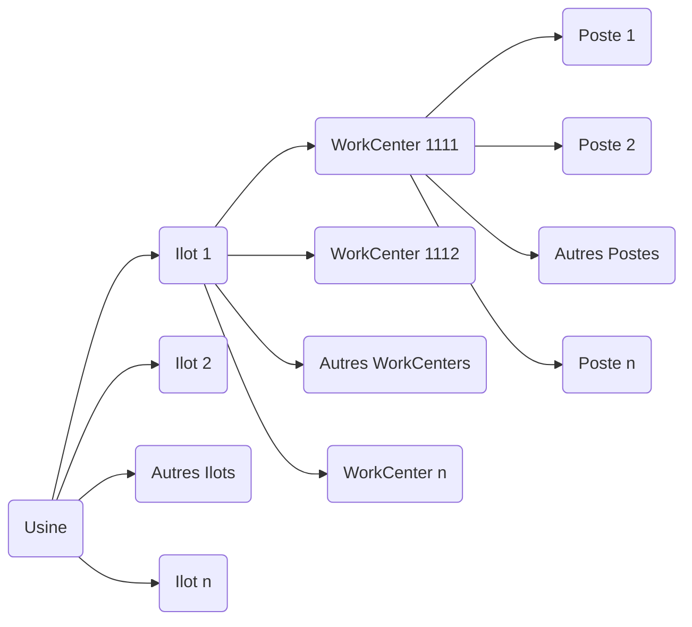

# L'entreprise Raynet

## Présentation
L'entreprise Raynet a été créée en 2000 et vise à supporter le réseau ARaymond Information System. Elle contribue aux activités des compagnies en fournissant une expertise technique dans de nombreuses zones comme le support IT, l'infrastructure IT ou la gestion des systèmes d'information.  
Le siège social se situe au **113 cours Berriat, 38000 Grenoble, France**. C'est une société par actions simplifiées (SAS) avec un capital social de **25 000 euros**.

Raynet se concentre essentiellement sur :
- Le développement de systèmes d'information.
- La fourniture de solutions IT innovantes, centrées sur la création de valeur pour ses clients.
- La gestion d'installations informatiques.

En parallèle, Raynet joue un rôle clé dans la fabrication et la simulation de pièces industrielles via son logiciel **Raypro**, utilisé principalement dans le domaine automobile pour concevoir, simuler et optimiser les processus de production.

---

## Chiffres clés
- **Effectif** : 250 personnes dans le monde.
- **Chiffre d'affaires** : 54 millions d'euros en 2023 (+8,52 % par rapport à 2022).
- **Exportation** : Une part importante du chiffre d'affaires provient des marchés internationaux, représentant environ 80 % des revenus.

---

## Une présence mondiale
Bien que le siège social soit à Grenoble, Raynet possède des bureaux et installations dans plusieurs pays :

### **Europe**
- **France** : Siège social à Grenoble.
- **Allemagne** : Paderborn (siège principal), Regensburg, Ingolstadt, Berlin.
- **Italie**, **Espagne**, **Pologne**, **Royaume-Uni**, **Turquie**.

### **Amérique du Nord**
- **États-Unis** : Schaumburg, Illinois.

### **Asie**
- **Japon** : Tokyo.  
(Absence en Chine due à des conflits politiques.)

### **Afrique du Nord**
- **Maroc** : Casablanca.

Raynet fait partie du réseau ARaymond, présent dans **21 pays sur 4 continents** avec plus de **35 filiales**, ce qui lui permet de bénéficier d'une forte implantation internationale pour répondre aux besoins variés de ses clients.

---

## Logiciel phare : Raypro
Raynet développe et utilise le logiciel **Raypro**, conçu pour la construction et la simulation de pièces industrielles. Ce logiciel est particulièrement utilisé dans :
- Le domaine automobile pour concevoir des pièces complexes.
- Simuler leur comportement avant fabrication.
- Optimiser les processus de production.  

Raypro joue un rôle essentiel dans l'intégration des étapes de conception, prototypage et fabrication dans un flux de travail rationalisé.

---

Raynet est une entreprise dynamique alliant expertise informatique et industrielle, avec une forte présence mondiale et un engagement envers l'innovation technologique.

# Méthodes de travail et outils

## Versionnage

Nous travaillons sur trois versions distinctes du logiciel, chacune ayant un rôle spécifique dans le cycle de développement :

- **Version de production** : La version la plus stable et éprouvée. Elle est utilisée en environnement réel.
- **Version de test** : Une version intermédiaire, plus récente que la version de production, utilisée pour les tests approfondis.
- **Version de développement** : La version la plus récente, où les nouvelles fonctionnalités et correctifs sont en cours de développement.

## Cycle de mise à jour des versions

Lorsque la version de test est validée et passe en production, les versions évoluent comme suit :

1. La **version de production** prend la place de la version de test.
2. La **version de test** prend la place de la version de développement.
3. Une nouvelle **version de développement** est créée avec un incrément.

> [!Example]
>
>## Versions initiales :
>
>- Version de production : `2.65`
>- Version de test : `2.66`
>- Version de développement : `2.67`
>
>## Après mise à jour :
>
>- Nouvelle version de production : `2.66` (ancienne version de test)
>- Nouvelle version de test : `2.67` (ancienne version de développement)
>- Nouvelle version de développement : `2.68` (incrémentée).

## Organisation physique de l'usine

L'organisation physique d'une usine peut être représentée sous forme hiérarchique, allant du niveau global (l'usine) au niveau le plus détaillé (les postes de travail).

Cette structure reflète une organisation typique :
- **Usine (Plant)** : Le site global.
- **Ilots (Ilots)** : Regroupements d'équipements ou d'activités similaires
- **WorkCenters** : Zones spécifiques dans un ilot où des processus précis sont effectués.
- **Postes (Workstations)** : Les unités les plus détaillées où les tâches sont réalisées

## Fonctionnement des logiciels
Trois logiciels principaux sont utilisés pour gérer et simuler les processus industriels :

| Logiciel               | Fonction principale                                                    | Utilisation en atelier |
| ---------------------- | ---------------------------------------------------------------------- | ---------------------- |
| **Raypro Supervision** | Modélisation et optimisation des chaînes de production complètes       | Oui                    |
| **Raypro Simulator**   | Simulation virtuelle des machines pour le développement et les tests   | Non                    |
| **Raypro Machine**     | Suivi en temps réel des performances et du fonctionnement des machines | Oui                    |

## Détails des logiciels

## 1. **Raypro Supervision**

Ce logiciel est conçu pour paramétrer et modéliser une chaîne complète de production. Ses principales fonctionnalités incluent :
- Identification des goulets d'étranglement et des inefficacités.
- Optimisation des flux grâce à une modélisation précise des processus, ressources et objets impliqués.

## 2. **Raypro Simulator**

Raypro Simulator permet la simulation virtuelle d'une machine physique, utile pour le développement et les tests sans nécessiter l'accès à une machine réelle. Ses avantages :
- Création d'un modèle virtuel précis d'une machine.
- Test des programmes et configurations avant leur mise en œuvre réelle.
- Réduction des coûts liés aux tests physiques.

## 3. **Raypro Machine**

Ce logiciel est utilisé directement sur les machines pour surveiller leur fonctionnement pendant la production. Il offre :
- Un suivi en temps réel des états des machines.
- Une détection rapide des problèmes ou dysfonctionnements.
- Un suivi précis des performances et délais pour chaque étape.

