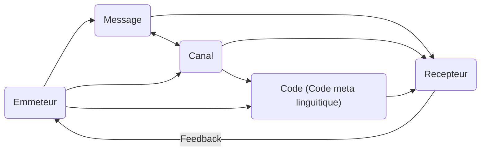

Comm non verbale avec gestes, posture
Le regard
La voix, l'intonation, l'attitude corporelle et gestuelle, la contrainte du temps, l'objectif du discours, garder l'attention de la personne qui écoute
Biens structuré, phrase courte et bien articulé

6

Pourquoi bug ? insecte dans transistors pc qui a crash donc nom insecte ce qui a donné nom au bug.
On parle de debuggeur
Format c'est pas sorcier ?
Salut Jamy !

Utilisé a tort et a travers.
Souvent on pense que c'est arrivé dans un rapport envoyé par Grace Hooper (créatrice Cobol). On dit qu'elle aurait trouvé un bug dût à une mite trouvée dans l'ordinateur Mark 2. Terme bug n'est pas arrivé avec l'info. Jargon de l'ingénieurie. Traces par Thomas Eddison dans les traces de ses recherches.
Trop de sens. Pas la bonne couleur, le bouton ne s'affiche pas. Ce sont des erreurs des dévelopeurs minimes ou conséquentes par l'équipe de devs.

> [!tip]
> Durée 2 à 5 minutes
> Découper en unités pédagogiques
> Poser le sujet et s'y tenir
> Fil conducteur = colonne vertébrale
> ordre pertinent
> pauses
> Story board
> Essayer d'être graphiquement soi-même

**Faire un story board :**
- Graphique
- Ce qu'on voit à l'écran, voix / visage ...
- Pauses

> [!tip] Prise de parole
> Ne parle pas comme en classe
> Rédaction script
> Lecture fluide qui sert à évaluer temps de lecture
> Ne pas oublier d'ajuster public de langue
> Intro + Conclusion très important
> Formules d'accroches "Bonjour à toutes et à tous"
> Conclusion : Reprendre objectif princpale. Formule de conclusion (renvoyer vers d'autres ressources complémentaires ou note d'humour)
> Travailler débit ; pas trop lent ou rapide
> Se relacher
> Etre pertinent
> Poser un constat, ce que c'est

**Type de discours :**
- Informationel
- Narration
- Descriptif
- Argumentatif

1 sujet précis
→ Objectif / retenu
2) Problématique *1 question*
3) Type de discours
   → Informer
   → Développer
   → Raconter une histoire
1) Storyboard
2) Script

En quoi les bugs sont un problème ?
En quelles mesures un bug peut causer un gros impact
Informatif

**Brayan :** [Joue à un jeu buggué]
- Ohlala, ce jeu ne marche pas !
[Avance vers Sophie]
Oh ! Une développeuse ! Elle saura peut être pourquoi mon jeu ne marche pas. Excusez-moi, pouvez-vous m'expliquer pourquoi mon jeu ne marche pas ?
**Sophie :** Ce doit probablement être à cause d'un bug. D'ailleurs, ce petit disfonctionnement n'est pas très grave en soi, mais un simple bug peut causer d'énormes dégats notemment dans l'aviation comme la fusée Ariane 5. 
**Brayan :** Mais Thomas, En quelles mesures un bug peut causer un gros impact ?
**Thomas :** *Plus d'explications sur la fusée Ariane 5 mais tu donne aussi des exemples de moins en moins grave pour accentuer le fait qu'il y est plusieurs echelle de consequences (Bug jeu vidéo, bug fusée grave, bug application de test non grave)*
→Si on reprend l'exemple de la fusée Arrianne, lors du décollage de la fusée Ariane 5, les réacteurs étaient mals calibrés. La raison ? une taille de variable **explication de ce qu'est une variable** , qui est une boite de données trop courte par rapport à la donnée qu'elle devait contenir. Cela à causé de nombreux bugs. La conséquence a été le crash de la fusée, ce qui a coûté des millions de dollars de coûts
→ Cependant, les bugs n'ont pas toujours un aussi gros impact. Cela peut aller d'un simple bug de couleur de mur, jusqu'à un personnage qui le traverse, ce qui est beaucoup plus grave, ou bien encore l'histoire de la fusée qui est catastrophique. C'est pour cela qu'il faut examiner régulièrement son code pour trouver et corriger les bugs le plus rapidement possible
→ Cependant, tous les bugs ne sont pas aussi graves. En effet, un bug informatique peut avoir des conséquences minimes, comme un simple bug de texture dans un jeu vidéo (un personnage qui traverse un mur). Cependant, il faut quand même faire attention car si un bug est trop présent, cela peut par exemple rendre un jeu injouable.
**Brayan** :  donc si je comprends bien ce que tu me dis là Jamy un bug il faut régler ca vite, car au fur et a mesure que le temps passe, le régler sera plus compliqué, c'est un peu comme si dans une salle de classe, lors de ça construction, on sait qu'une chaise cassé s'y trouve mais lorsque la construction de l'établissement est finit, cela sera comme chercher une aiguille dans une botte de foin enfaite ?
**Sophie** : En effet il faut examiner son code de façon précise mais un très bonne outils à été créer pour cela justement, c'est le débugger 
**Brayan :** Le débugger, c'est plutôt connu comme nom mais en réalité comment ca marche jamy ? 
**Thomas :**
Un débugger, c'est un outil logiciel qui est utilisé par les développeurs pour corriger des bugs et des erreurs dans un programme informatique (par ex : un jeu vidéo, une application mobile ...). Techniquement, il permet de suivre le code pas à pas, ligne par ligne, afin de comprendre exactement d'où vient le bug, et cela permet de savoir comment il est produit car le débugger nous permet d'examiner le contenu d'une variable à chaque ligne exécutée.
**Brayan : ** Allez, moi je retourne débugger pour régler les bugs de mon jeu !

**Explications Ariane 5 :**
video pas plus de 30 secondes

En effet, ce "petit" bug a en fait causé l'explosion de la Fusée ce qui a en réalité coûté 500 millions de dollars. Mais rassurez-vous ! Cela coûte rarement aussi cher. Généralement, si vous codez un logiciel ou une application qui ne nécessite pas de matériel physique, le coût est généralement moindre ! Si vous faites un jeu vidéo, un bug peut simplement être de passer à travers une barrière

**Brayan :** [Joue à un jeu buggué]
- Ohlala, mais qu'est ce que ce que ce jeu est bugué. allons voir ensemble ce qui se passe !
[Voie Sophie qui code]
- Mais qu'est ce que vous faites ! Pourquoi y a-t'il autant de rouge ?
**Sophie** : Ce sont des bugs, mais il est possible de les résoudre assez facilement grâce au débugger
**Brayan :** Mais Jamy, qu'est ce qu'un débugguer ?
**Thomas :** Explique ce qu'est un débugger
**Brayan :** D'ailleurs, il y a déja eu des gros bugs qui ont causé d'énormes dégâts, comme la fusée Ariane !
**Sophie :** Oui, c'est pourquoi c'est important de bien débugguer avec plus d'explications sur fusée Ariane
 
**Sophie :** [Code mais plein de rouge]

Introduction : Joue a une jeu codé avec le cul **Brayan**
**Sophie** code avec plein de rouge. **Brayan**, casse couille comme il est, s'incruste. **Sophie** explique un peu
POV de **Thomas** qui donne plus de détails sur comment détailler

Selon WIkipedia, *Plus le code est complexe, plus il est difficile de localiser un bug*. Nous utilisons donc le débugger pour débugger le code, donc pour enlever les potentielles erreurs.
⇒ Code plus simple pour moins de bugs

**Conclusion** : Même les bugs les plus minimes peuvent avoir des conséquences catastrophiques donc il est important de les corriger