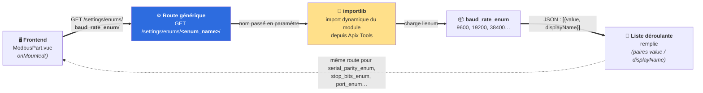

```mermaid
flowchart LR
    FRONT["🖥️ <b>Frontend</b><br/>ModbusPart.vue<br/><i>onMounted()</i>"]
    ROUTE["⚙️ <b>Route générique</b><br/>GET /settings/enums/<b>&lt;enum_name&gt;</b>/"]
    IMPORT["🐍 <b>importlib</b><br/>import dynamique du module<br/>depuis Apix Tools"]
    ENUM["📦 <b>baud_rate_enum</b><br/>9600, 19200, 38400…"]
    DROP["🔽 <b>Liste déroulante</b><br/>remplie<br/><i>(paires value / displayName)</i>"]

    FRONT == "GET /settings/enums/<br/><b>baud_rate_enum</b>/" ==> ROUTE
    ROUTE == "nom passé en paramètre" ==> IMPORT
    IMPORT == "charge l'enum" ==> ENUM
    ENUM == "JSON : [{value, displayName}]" ==> DROP
    DROP -. "même route pour serial_parity_enum,<br/>stop_bits_enum, port_enum…" .-> FRONT

    style ROUTE fill:#2d6cdf,color:#fff
    style IMPORT fill:#ffe08a

```
