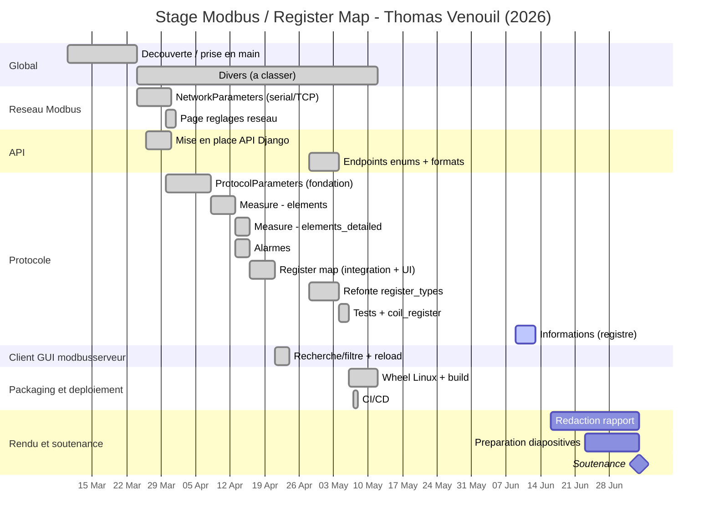

```mermaid
gantt
    title Stage Modbus / Register Map - Thomas Venouil (2026)
    dateFormat  YYYY-MM-DD
    axisFormat  %d %b

    section Global
    Decouverte / prise en main          :done,   g1, 2026-03-10, 2026-03-24
    Divers (a classer)                  :done,   g2, 2026-03-24, 2026-05-12

    section Reseau Modbus
    NetworkParameters (serial/TCP)      :done,   n1, 2026-03-24, 2026-03-31
    Page reglages reseau                :done,   n2, 2026-03-30, 2026-04-01

    section API
    Mise en place API Django            :done,   a1, 2026-03-26, 2026-03-31
    Endpoints enums + formats           :done,   a2, 2026-04-28, 2026-05-04

    section Protocole
    ProtocolParameters (fondation)      :done,   p1, 2026-03-30, 2026-04-08
    Measure - elements                  :done,   p2, 2026-04-08, 2026-04-13
    Measure - elements_detailed         :done,   p3, 2026-04-13, 2026-04-16
    Alarmes                             :done,   p4, 2026-04-13, 2026-04-16
    Register map (integration + UI)     :done,   p5, 2026-04-16, 2026-04-21
    Refonte register_types              :done,   p6, 2026-04-28, 2026-05-04
    Tests + coil_register               :done,   p7, 2026-05-04, 2026-05-06
    Informations (registre)             :active, p8, 2026-06-09, 2026-06-13

    section Client GUI modbusserveur
    Recherche/filtre + reload           :done,   c1, 2026-04-21, 2026-04-24

    section Packaging et deploiement
    Wheel Linux + build                 :done,   d1, 2026-05-06, 2026-05-12
    CI/CD                               :done,   d2, 2026-05-07, 2026-05-08

    section Rendu et soutenance
    Redaction rapport                   :        r1, 2026-06-16, 2026-07-04
    Preparation diapositives            :        r2, 2026-06-23, 2026-07-04
    Soutenance                          :milestone, r3, 2026-07-04, 0d

```

