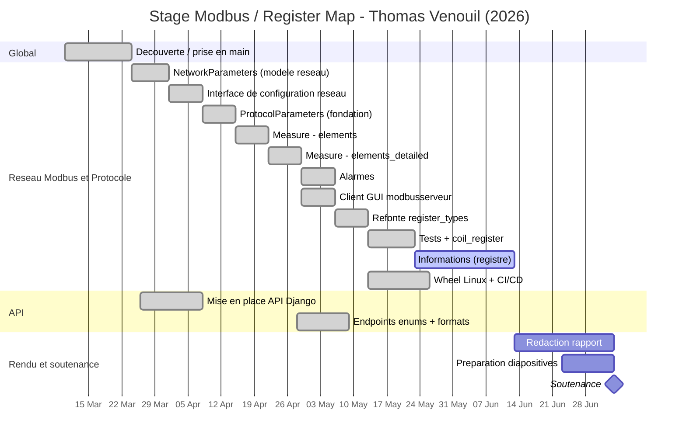

```mermaid
gantt
    title Stage Modbus / Register Map - Thomas Venouil (2026)
    dateFormat  YYYY-MM-DD
    axisFormat  %d %b

    section Global
    Decouverte / prise en main              :done,   g1, 2026-03-10, 2026-03-24

    section Reseau Modbus et Protocole
    NetworkParameters (modele reseau)       :done,   p1,  2026-03-24, 2026-04-01
    Interface de configuration reseau       :done,   p2,  2026-04-01, 2026-04-08
    ProtocolParameters (fondation)          :done,   p3,  2026-04-08, 2026-04-15
    Measure - elements                      :done,   p4,  2026-04-15, 2026-04-22
    Measure - elements_detailed             :done,   p5,  2026-04-22, 2026-04-29
    Alarmes                                 :done,   p6,  2026-04-29, 2026-05-06
    Client GUI modbusserveur                :done,   p7,  2026-04-29, 2026-05-06
    Refonte register_types                  :done,   p8,  2026-05-06, 2026-05-13
    Tests + coil_register                   :done,   p9,  2026-05-13, 2026-05-23
    Informations (registre)                 :active, p10, 2026-05-23, 2026-06-13
    Wheel Linux + CI/CD                      :done,   p11, 2026-05-13, 2026-05-26

    section API
    Mise en place API Django                :done,   a1, 2026-03-26, 2026-04-08
    Endpoints enums + formats               :done,   a2, 2026-04-28, 2026-05-09

    section Rendu et soutenance
    Redaction rapport                       :        r1, 2026-06-13, 2026-07-04
    Preparation diapositives                :        r2, 2026-06-23, 2026-07-04
    Soutenance                              :milestone, r3, 2026-07-04, 0d

```

