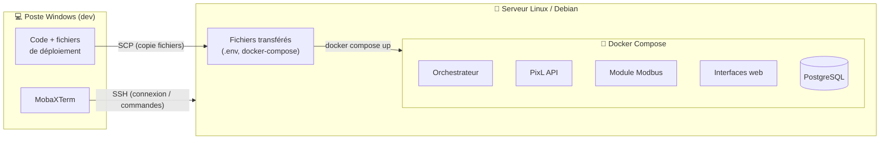

```mermaid

flowchart LR

    subgraph WIN["💻 Poste Windows (dev)"]

        A["Code + fichiers<br/>de déploiement"]

        M["MobaXTerm"]

    end

  

    subgraph LNX["🐧 Serveur Linux / Debian"]

        direction TB

        F["Fichiers transférés<br/>(.env, docker-compose)"]

        subgraph DOCK["🐳 Docker Compose"]

            direction TB

            O["Orchestrateur"]

            API["PixL API"]

            MOD["Module Modbus"]

            WEB["Interfaces web"]

            DB[("PostgreSQL")]

        end

        F -->|"docker compose up"| DOCK

    end

  

    A -->|"SCP (copie fichiers)"| F

    M -->|"SSH (connexion / commandes)"| LNX

```
