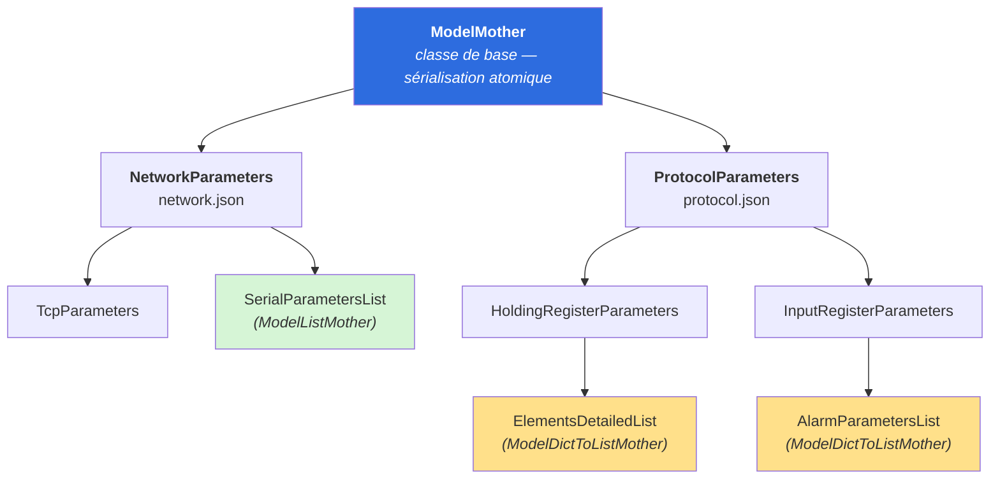

```mermaid
flowchart TD
    MM["<b>ModelMother</b><br/><i>classe de base — sérialisation atomique</i>"]
    MM --> NP["<b>NetworkParameters</b><br/>network.json"]
    MM --> PP["<b>ProtocolParameters</b><br/>protocol.json"]

    NP --> TCP["TcpParameters"]
    NP --> SPL["SerialParametersList<br/><i>(ModelListMother)</i>"]

    PP --> HRP["HoldingRegisterParameters"]
    PP --> IRP["InputRegisterParameters"]

    HRP --> EDL["ElementsDetailedList<br/><i>(ModelDictToListMother)</i>"]
    IRP --> APL["AlarmParametersList<br/><i>(ModelDictToListMother)</i>"]

    style MM fill:#2d6cdf,color:#fff
    style EDL fill:#ffe08a
    style APL fill:#ffe08a
    style SPL fill:#d6f5d6
```

